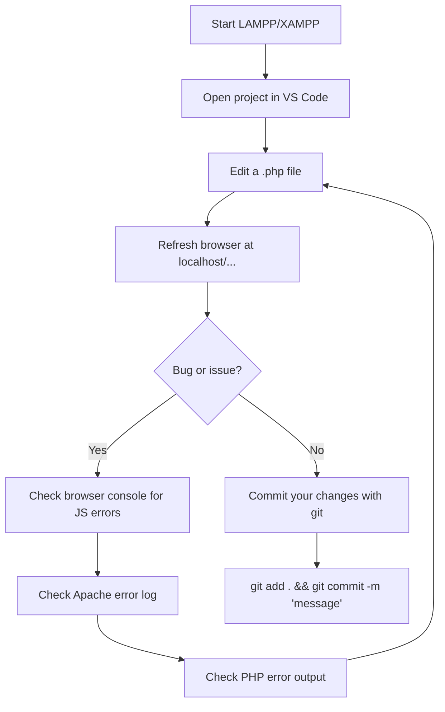

# 🚀 HemoLink — Getting Started Guide

> **Who is this for?** A brand new developer joining this project who needs to get it running on their machine.

---

## What You Need to Install First

Before you can run HemoLink, you need the following software. All of them are free.

| Software | What it is | Where to get it |
|---|---|---|
| **XAMPP** or **LAMPP** | Runs Apache + MySQL + PHP on your machine | [apachefriends.org](https://www.apachefriends.org) |
| **Git** | Version control | [git-scm.com](https://git-scm.com) |
| A code editor | For editing files | [VS Code](https://code.visualstudio.com) recommended |
| **PHP 8.1+** | Comes bundled with XAMPP/LAMPP | — |

---

## Step-by-Step Setup

### Step 1 — Start XAMPP/LAMPP

**On Linux (LAMPP):**
```bash
sudo /opt/lampp/lampp start
```

**On Windows/Mac (XAMPP):**
Open the XAMPP Control Panel and click **Start** next to Apache and MySQL.

You should see both Apache and MySQL running.

---

### Step 2 — Clone the Repository

Navigate to the web server's document root:

**Linux:**
```bash
cd /opt/lampp/htdocs
git clone <repository-url> Blood-Bank-Management-System
```

**Windows (XAMPP):**
```bash
cd C:\xampp\htdocs
git clone <repository-url> Blood-Bank-Management-System
```

---

### Step 3 — Create the `.env` File

The `.env` file holds your database credentials and API keys. It's not stored in git, so you need to create it yourself.

In the project root (`Blood-Bank-Management-System/`), create a file called `.env` with this content:

```
DB_HOST=localhost
DB_NAME=bms_db
DB_USER=root
DB_PASS=

PAYSTACK_PUBLIC_KEY=pk_test_your_key_here
PAYSTACK_SECRET_KEY=sk_test_your_key_here
PAYSTACK_CURRENCY=KES

PLAN_STARTER_MONTHLY=6000
PLAN_PRO_MONTHLY=18000
PLAN_ENTERPRISE_MONTHLY=45000
```

> ⚠️ **Leave `DB_PASS` empty if your local MySQL has no root password** (default for XAMPP/LAMPP).

---

### Step 4 — Create the Database

Open a terminal and run:

**Linux:**
```bash
/opt/lampp/bin/mysql -u root -e "CREATE DATABASE IF NOT EXISTS bms_db;"
```

**Windows (from XAMPP mysql bin):**
```bash
mysql -u root -e "CREATE DATABASE IF NOT EXISTS bms_db;"
```

Or use **phpMyAdmin** (visit `http://localhost/phpmyadmin`) to create a database called `bms_db`.

---

### Step 5 — Import the Schema

```bash
# Linux
/opt/lampp/bin/mysql -u root bms_db < /opt/lampp/htdocs/Blood-Bank-Management-System/"BMS SCHEMA.sql"

# Windows (from project folder)
mysql -u root bms_db < "BMS SCHEMA.sql"
```

This creates all 14 tables.

---

### Step 6 — Load Sample Data

```bash
# Linux
/opt/lampp/bin/mysql -u root bms_db < /opt/lampp/htdocs/Blood-Bank-Management-System/seed.sql

# Windows
mysql -u root bms_db < seed.sql
```

This populates the database with test users, hospitals, blood units, and requests.

---

### Step 7 — Open in Browser

Visit: **`http://localhost/Blood-Bank-Management-System/index.php`**

You should see the HemoLink landing page.

---

## Test Login Credentials

| Who | Email | Password |
|---|---|---|
| 🛡️ Admin | `admin@hemolink.com` | `admin123` |
| 🏥 Hospital Manager (KNH) | `manager@knh.go.ke` | `hospital123` |
| 🏥 Hospital Manager (Aga Khan) | `manager@agakhan.org` | `hospital123` |
| 🩸 Donor (O+) | `brian.otieno@gmail.com` | `donor123` |
| 🩸 Donor (O- Universal) | `david.odhiambo@gmail.com` | `donor123` |
| 🩸 Donor (A+) | `grace.wanjiku@gmail.com` | `donor123` |

---

## Troubleshooting Common Issues

### "Database connection failed"

Check these things:
1. Is MySQL running? (Check XAMPP/LAMPP control panel)
2. Does `.env` exist in the project root?
3. Is the database name in `.env` correct? (should be `bms_db`)
4. Does the database exist? (run `CREATE DATABASE bms_db`)

### "Column not found" / SQL errors

The schema may be out of date. Reset the database:
```bash
/opt/lampp/bin/mysql -u root bms_db < "BMS SCHEMA.sql"
/opt/lampp/bin/mysql -u root bms_db < seed.sql
```

### Page not found / 404

Check your `.htaccess` file is in the project root. Apache needs `mod_rewrite` enabled:
```bash
# Linux
sudo a2enmod rewrite
sudo service apache2 restart
```

### Blank page with no error

Turn on PHP error display temporarily:
```php
// At the very top of index.php (remove in production):
ini_set('display_errors', 1);
error_reporting(E_ALL);
```

---

## Project URL Structure

All pages use the `?page=` query parameter:

| URL | What you see |
|---|---|
| `/index.php` | Landing page |
| `/index.php?page=login` | Login form |
| `/index.php?page=admin_dashboard` | Admin dashboard |
| `/index.php?page=hospital_dashboard` | Hospital dashboard |
| `/index.php?page=donor_dashboard` | Donor dashboard |
| `/index.php?page=admin_donors` | Admin donor management |
| `/index.php?page=hospital_requests` | Hospital blood requests |

---

## Making Your First Code Change

Here's a quick exercise to get familiar with the codebase — add a welcome message to the admin dashboard:

1. Open `views/admin/dashboard.php`
2. Find the section near the top with the greeting
3. Change the text or add a line
4. Refresh the browser — PHP is interpreted live, no build step needed

That's the beauty of PHP — **save → refresh → done**.

---

## Daily Development Workflow



**View Apache error logs (Linux):**
```bash
tail -f /opt/lampp/logs/error_log
```

---

## Recommended Reading Order

If you're brand new, read the docs in this order:

1. **[Architecture](01-architecture.md)** — Understand the big picture
2. **[Getting Started](00-getting-started.md)** — You are here ✅
3. **[Codebase Guide](02-codebase-guide.md)** — What every file does
4. **[User Journey](03-user-journey.md)** — What each user type does
5. **[Database Guide](05-database.md)** — Understanding the data
6. **[Security Guide](04-security.md)** — How the app is protected
