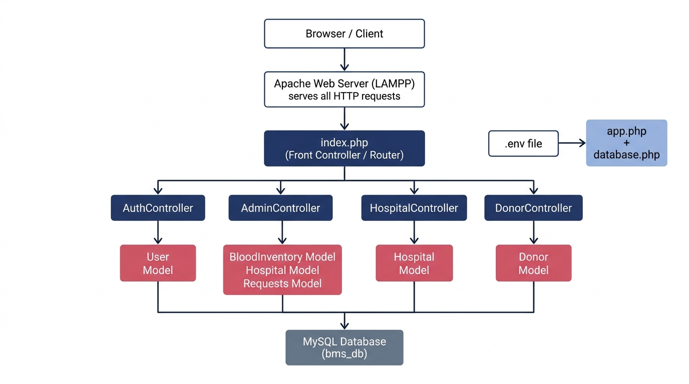
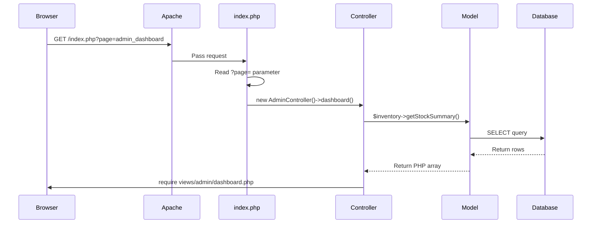
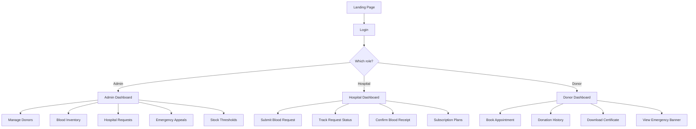

# 🏗️ HemoLink — System Architecture

> **Who is this for?** Anyone new to this project who wants to understand how the pieces fit together before touching any code.

---

## What is HemoLink?

HemoLink is a **PHP web application** for managing a blood bank. It connects three types of users — **Blood Bank Admins**, **Hospital Managers**, and **Blood Donors** — and handles everything from blood inventory tracking to emergency donor appeals and hospital subscriptions.

It runs on a **LAMPP** stack:
- **L**inux
- **A**pache web server
- **M**ySQL database
- **P**HP (server-side language)

---

## The Big Picture

Here's how a request flows from a user's browser to the database and back:



---

## Architecture Pattern: MVC

HemoLink follows the **MVC pattern** — Model, View, Controller. Think of it like a restaurant:

| MVC Layer | Restaurant Analogy | In HemoLink |
|---|---|---|
| **Model** | The kitchen — prepares the food (data) | PHP classes in `/models/` that query the database |
| **View** | The dining room — what the customer sees | PHP/HTML templates in `/views/` |
| **Controller** | The waiter — takes orders, relays to kitchen, brings food back | PHP classes in `/controllers/` |

---

## How a Page Request Works

Here's what happens step by step when someone visits a URL like `index.php?page=admin_dashboard`:



---

## The Front Controller (`index.php`)

Everything in HemoLink goes through **one file**: `index.php`. This is called the "Front Controller" pattern.

It reads the `?page=` URL parameter and decides what to do:

```
URL: /index.php?page=admin_donors
         ↓
index.php reads page = "admin_donors"
         ↓
Creates new AdminController()
         ↓
Calls AdminController->manageDonors()
         ↓
Controller loads data and renders views/admin/donors.php
```

This means **there is no separate file for each page** — all routing is in `index.php`.

---

## Folder Structure

```
Blood-Bank-Management-System/
│
├── index.php              ← The front controller (all requests come here)
├── .env                   ← Secret config (DB password, Paystack keys) — NOT in git
├── .htaccess              ← Apache URL config
├── BMS SCHEMA.sql         ← Database schema (run to set up DB)
├── seed.sql               ← Sample data for testing
│
├── config/
│   ├── app.php            ← App constants (APP_NAME, roles, plans, etc.)
│   ├── database.php       ← Database connection class (Singleton PDO)
│   └── init.php           ← Bootstrap file — loads everything at startup
│
├── controllers/
│   ├── AuthController.php      ← Login, logout, registration
│   ├── AdminController.php     ← Blood bank admin features
│   ├── HospitalController.php  ← Hospital manager features
│   └── DonorController.php     ← Donor-facing features
│
├── models/
│   ├── User.php            ← Authentication & user records
│   ├── BloodInventory.php  ← Blood stock, units, appeals, thresholds
│   ├── Hospital.php        ← Hospital records and requests
│   ├── Donor.php           ← Donor profiles, donations, health
│   ├── Requests.php        ← Blood requisition logic
│   └── Payment.php         ← Paystack subscription payments
│
├── views/
│   ├── landing.php         ← Public homepage
│   ├── auth/               ← Login and registration pages
│   ├── admin/              ← Admin dashboard pages
│   ├── hospital/           ← Hospital manager pages
│   ├── donor/              ← Donor portal pages
│   └── layouts/            ← Shared headers, footers, sidebar layouts
│
└── Docs/                   ← You are here! 📖
```

---

## The Three Portals

The system has three completely separate dashboards, each only accessible to the right user type:



---

## Database Connection

The database uses a **Singleton pattern** — this means only ONE database connection is ever created, no matter how many models are used. All models get it the same way:

```php
// Every model does this in its constructor:
$this->db = Database::getInstance()->getConnection();
// Returns a PDO object (PHP's modern database interface)
```

Credentials come from the `.env` file, which is **not committed to git** for security.

---

## Key Design Decisions

| Decision | Why |
|---|---|
| Single `index.php` router | Simple to trace, no complex routing library needed |
| MVC pattern | Keeps HTML, logic, and data separate — easier to edit one without breaking others |
| All roles in one `users` table | No JOIN needed to find any user's role. Donor-specific fields are just NULL for non-donors |
| PDO with prepared statements | Prevents SQL injection attacks |
| Bcrypt password hashing | Industry standard — even if the DB is stolen, passwords can't be read |
| `.env` for secrets | API keys and passwords never end up in git history |

---

## Next Steps

- 📖 [Codebase File Guide](02-codebase-guide.md) — What every important file does
- 🚶 [User Journey](03-user-journey.md) — How each user type interacts with the system
- 🔒 [Security Features](04-security.md) — How HemoLink protects data
