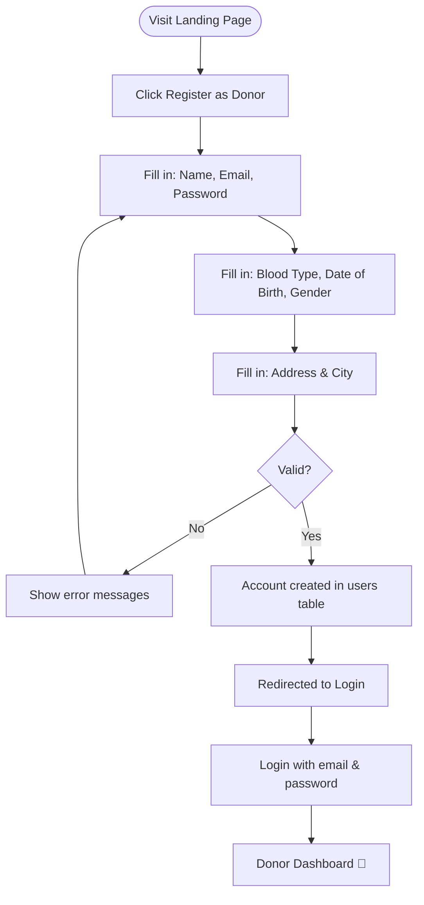
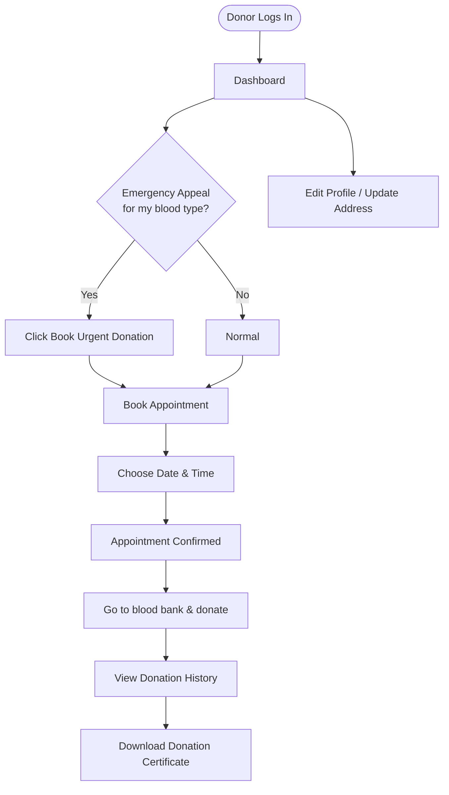
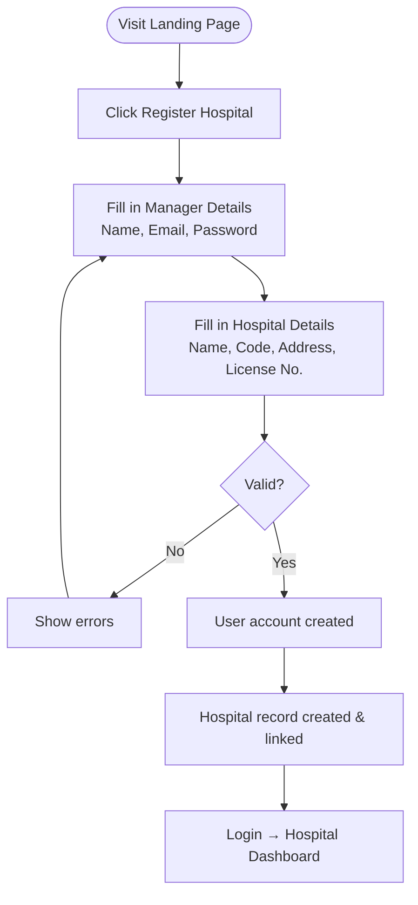
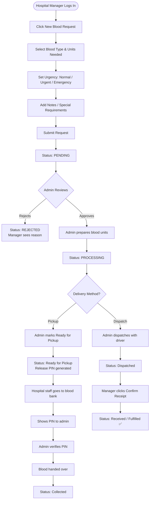
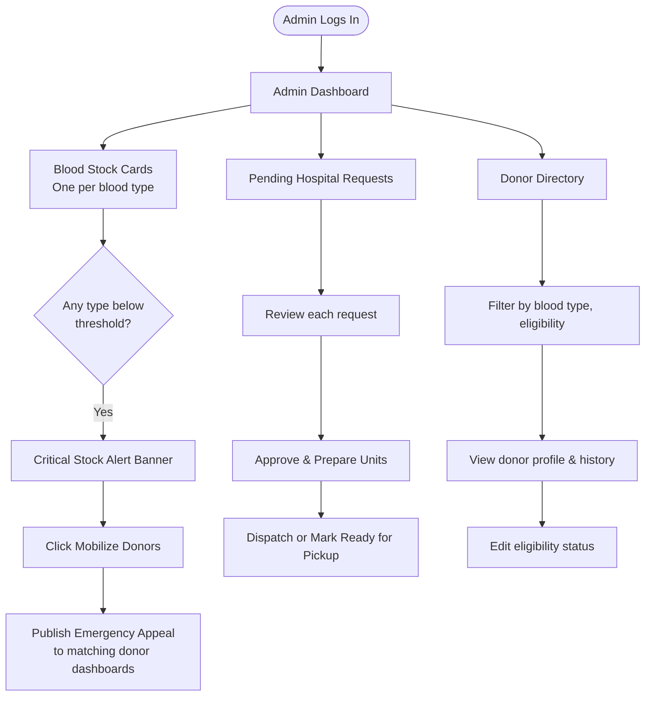
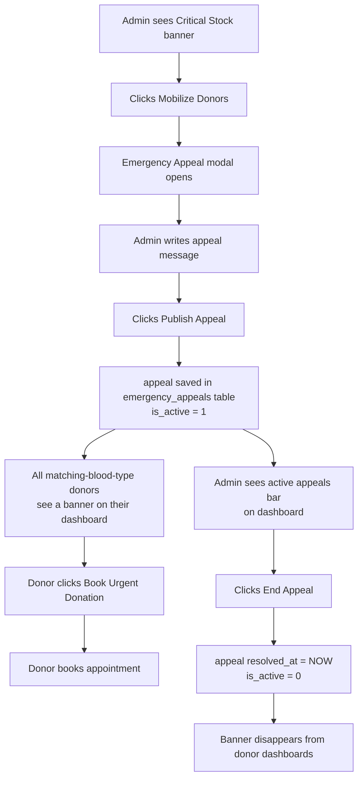
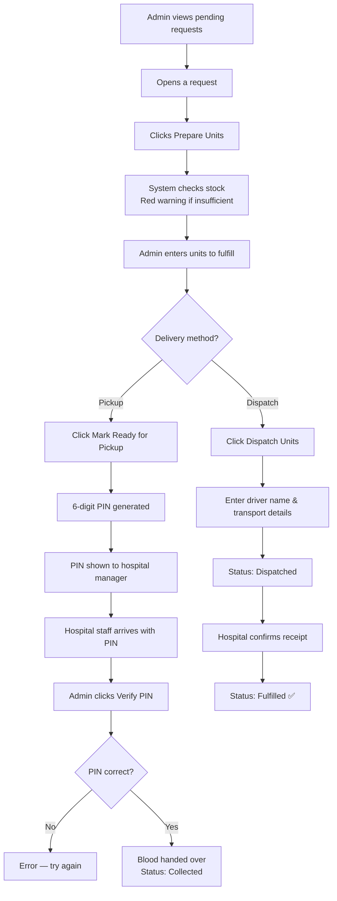
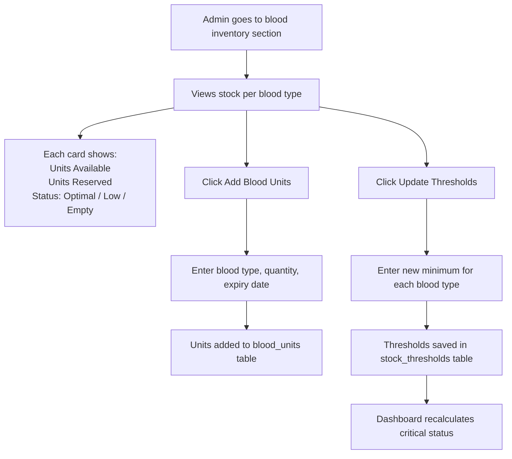

# 🚶 HemoLink — User Journey Guide

> **Who is this for?** Anyone who wants to understand what each type of user can do, step by step.

HemoLink has three types of users. Each gets their own dashboard and workflow:

---

## 1. 🩸 Blood Donor

Donors are community members who donate blood. They self-register through the public website.

### Registration Journey



### Ongoing Donor Journey

Once registered and logged in, here's what a donor does:



### Donor Portal Pages

| Page | What to do there |
|---|---|
| **Dashboard** | See your next appointment, total donations, and any emergency blood appeals |
| **Appointments** | Book, reschedule, or cancel donation appointments |
| **Donation History** | See all your past donations with dates and locations |
| **Certificate** | Download a certificate for any completed donation |
| **Profile** | Update your contact details and city |

### What a Donor CANNOT do
- ❌ See other donors' information
- ❌ View hospital requests or inventory
- ❌ Access admin features

---

## 2. 🏥 Hospital Manager

Hospital managers represent partner hospitals and clinics that need blood for their patients.

### Registration Journey



### Requesting Blood

This is the core workflow for hospital managers:



### Hospital Portal Pages

| Page | What to do there |
|---|---|
| **Dashboard** | See pending requests, monthly stats, subscription status |
| **Blood Requests** | View all requests, submit new ones, track statuses |
| **Request Detail** | See full timeline, collection status, and the release PIN for pickup |
| **Subscription** | Compare plans (Starter, Professional, Enterprise) and upgrade via Paystack |

### Request Status Flow

Each request moves through these statuses:

```
Pending → Processing → [Ready for Pickup / Dispatched] → [Collected / Received] → Fulfilled
                                                       ↘ Rejected / Cancelled
```

| Status | What it means |
|---|---|
| `Pending` | Submitted, awaiting admin review |
| `Processing` | Admin accepted and is preparing units |
| `Ready for Pickup` | Blood is bagged, waiting for hospital pickup with PIN |
| `Dispatched` | Blood is on its way via courier/ambulance |
| `Collected` | Hospital picked up the blood (PIN verified) |
| `Received` | Hospital confirmed delivery |
| `Fulfilled` | Request fully complete |
| `Partially Fulfilled` | Only some units were available |
| `Rejected` | Denied by admin (e.g., insufficient stock) |
| `Cancelled` | Cancelled by hospital |

### Subscription Plans

Hospital managers can upgrade their plan to unlock more features:

| Plan | Monthly Price | Request Limit | Emergency Priority |
|---|---|---|---|
| **Starter** (Clinic) | KES 6,000 | 15/month | ❌ |
| **Professional** (Hospital) | KES 18,000 | Unlimited | ✅ |
| **Enterprise** (Network) | KES 45,000 | Unlimited | ✅ |

Annual billing saves **15%**.

---

## 3. 🛡️ Blood Bank Admin

The admin manages the entire system — inventory, donors, hospitals, and emergency responses.

### Admin Dashboard Overview

When the admin logs in, they see:



### Emergency Appeal Workflow

When a blood type hits critical levels:



### Blood Request Fulfilment Workflow



### Inventory Management

Admins control both the stock and the safety thresholds:



### Admin's Full Capabilities

| Feature | What the admin can do |
|---|---|
| **Donors** | View all donors, add manually, edit details, defer eligibility, delete |
| **Hospitals** | View all hospitals, see their request history and subscription status |
| **Blood Requests** | Review, approve, reject, fulfill, dispatch, verify PIN |
| **Inventory** | Add units, set thresholds, view stock per blood type |
| **Emergency Appeals** | Publish broadcasts to eligible donors, end active appeals |
| **Users** | View all system accounts, enable/disable any user |
| **Appointments** | View and delete donor appointments |

---

## 4. 🌐 Public Visitor (Not Logged In)

Even without an account, visitors can:

- Visit the **landing page** (`index.php`)
- Register as a **Donor**
- Register as a **Hospital**
- Access the **login page**

Attempting to visit any dashboard page while not logged in will redirect to the login page automatically.

---

## Session Data

Once logged in, the following data is stored in the session and used throughout:

| Key | Example Value | Used for |
|---|---|---|
| `$_SESSION['user_id']` | `5` | Identifying the logged-in user |
| `$_SESSION['role']` | `'Donor'` | Role-based access control |
| `$_SESSION['username']` | `'brian.otieno'` | Display in nav |
| `$_SESSION['first_name']` | `'Brian'` | Personalised greeting |
| `$_SESSION['email']` | `'brian@gmail.com'` | Profile reference |
