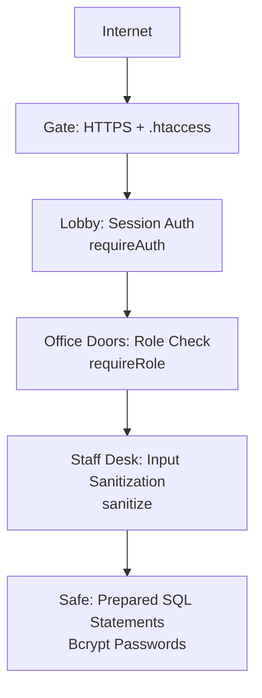
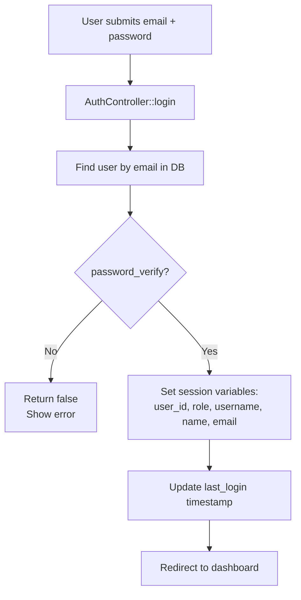
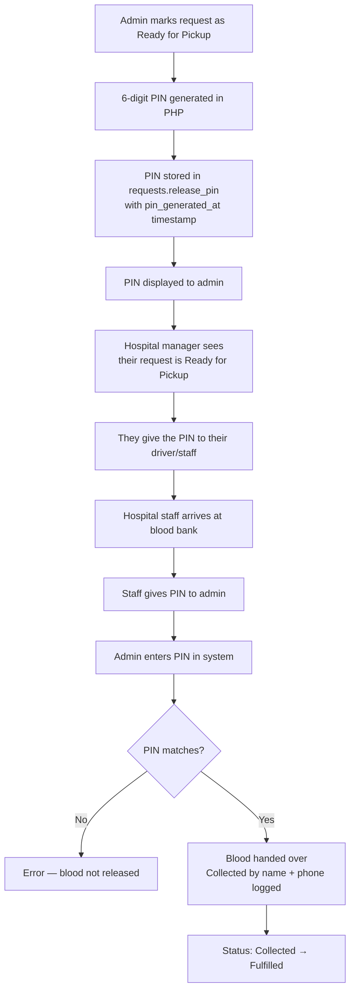

# 🔒 HemoLink — Security Guide

> **Who is this for?** Developers who want to understand how HemoLink protects user data and prevents attacks.

---

## Overview

Security in HemoLink works in **layers** — each layer stops a different type of attack. Think of it like a building with a gate, a lobby security desk, locked office doors, and a safe inside.



---

## 1. 🔑 Password Security — Bcrypt Hashing

Passwords are **never stored as plain text**. When a user registers, their password goes through `bcrypt` — a one-way hashing algorithm.

**How it works:**

```
User types: "mypassword123"
             ↓  password_hash(..., PASSWORD_BCRYPT)
Stored in DB: "$2y$10$VeFyOBuHxJ205g8VAlqiUu..."
```

When they log in:

```
User types: "mypassword123"
DB has: "$2y$10$VeFyOBuHxJ205g8VAlqiUu..."
        ↓  password_verify("mypassword123", $hash)
Result: true ✅  (or false if wrong)
```

**Why this matters:** Even if someone steals the entire database, they **cannot read the passwords**. Bcrypt is designed to be computationally slow, making brute-force attacks impractical.

**Where it happens:**
- Hashing: [`User.php` → `register()`](../models/User.php) — `password_hash($data['password'], PASSWORD_BCRYPT)`
- Verifying: [`User.php` → `login()`](../models/User.php) — `password_verify($password, $user['password_hash'])`

---

## 2. 🛡️ SQL Injection Prevention — Prepared Statements

SQL Injection is one of the most common web attacks. It happens when user input is put directly into a database query:

```php
// ❌ DANGEROUS (not used in HemoLink):
$sql = "SELECT * FROM users WHERE email = '$email'";
// Attacker could set $email = "' OR 1=1 --" and access all records

// ✅ SAFE (what HemoLink uses):
$stmt = $this->db->prepare("SELECT * FROM users WHERE email = :email");
$stmt->execute(['email' => $email]);
```

With **prepared statements**, the database treats the user's input as data — not as SQL code. The `:email` is a placeholder, and its value is sent separately so it can never modify the query structure.

**Every single database query in HemoLink uses prepared statements.** You can verify this by searching the `models/` folder — there are no raw string interpolations inside SQL queries.

---

## 3. 🚪 Authentication — Session-Based Login

HemoLink uses PHP sessions to track who is logged in.

**Login process:**



**Session variables set on login:**

```php
$_SESSION['user_id']   = $user['user_id'];
$_SESSION['role']      = $user['role'];        // 'Admin', 'Hospital', or 'Donor'
$_SESSION['username']  = $user['username'];
$_SESSION['first_name']= $user['first_name'];
```

**Session security settings** (in `config/app.php`):

```php
ini_set('session.cookie_httponly', 1);   // JavaScript cannot read the session cookie
ini_set('session.use_strict_mode', 1);  // Rejects unrecognised session IDs
```

---

## 4. 🔐 Authorization — Role-Based Access Control

Just being logged in isn't enough. Every protected route also checks **which role** the user has.

**`requireAuth()`** — checks if the user is logged in at all:
```php
function requireAuth(): void {
    if (!isLoggedIn()) {
        header('Location: .../index.php?page=login');
        exit;
    }
}
```

**`requireRole($role)`** — checks for a specific role:
```php
function requireRole(string $roleId): void {
    requireAuth();   // Must be logged in first
    if (getUserRole() != $roleId) {
        header('Location: .../index.php?page=unauthorized');
        exit;
    }
}
```

**How it's used in every controller:**

```php
// In AdminController — admin-only pages:
requireRole(ROLE_ADMIN);  // Kicks out non-admins instantly

// In HospitalController:
requireRole(ROLE_HOSPITAL);

// In DonorController:
requireRole(ROLE_DONOR);
```

**What a hospital manager sees if they try to access the admin dashboard directly:**
→ They are immediately redirected to the **Unauthorized** page (403).

---

## 5. 🧹 XSS Prevention — Input Sanitization

XSS (Cross-Site Scripting) is when an attacker puts malicious JavaScript into a form, and it gets displayed on a page and runs in another user's browser.

HemoLink has a global `sanitize()` function that is used on **all user input**:

```php
function sanitize(?string $input): string {
    return htmlspecialchars(trim($input ?? ''), ENT_QUOTES, 'UTF-8');
}
```

`htmlspecialchars()` converts dangerous characters into safe HTML entities:

| Input | After sanitize |
|---|---|
| `<script>alert('hacked')</script>` | `&lt;script&gt;alert('hacked')&lt;/script&gt;` |
| `" OR 1=1 --` | `&quot; OR 1=1 --` |
| `O'Brian` | `O&#039;Brian` |

**Rule:** Any data coming from `$_POST`, `$_GET`, or the database that gets displayed to a user MUST be passed through `sanitize()` first.

---

## 6. 🌐 Environment Variables — Secret Management

API keys (like Paystack secret keys) and database passwords are **never stored in code**. They live in a `.env` file that is:
- Listed in `.gitignore` (never committed)
- Read once at startup by `config/app.php`
- Accessed through PHP constants like `PAYSTACK_SECRET_KEY`

```
.env  ←  on server only, never in git
 ↓ loaded by config/app.php
 ↓ available as constants
PAYSTACK_SECRET_KEY → used to verify Paystack webhooks
DB_PASS → used to connect to MySQL
```

---

## 7. 📌 Secure Blood Handover — Release PIN System

For physical blood collection (Click & Collect), a 6-digit PIN is generated to ensure blood only goes to the right people.



**PIN generation (in `HospitalModel`):**
```php
$pin = str_pad(random_int(0, 999999), 6, '0', STR_PAD_LEFT);
```

`random_int()` is PHP's **cryptographically secure** random number function (unlike `rand()` which is not secure).

---

## 8. ✅ CSRF Protection (Form Method Enforcement)

All forms that change data (POST actions) are checked to ensure they actually came from a form submission, not from a link someone might trick a user into clicking.

```php
// Every write controller checks:
if ($_SERVER['REQUEST_METHOD'] !== 'POST') {
    redirect('some_page');
    return;
}
```

This means that someone can't just send a user a malicious link like:
`index.php?page=admin_donor_delete&id=5`
...and have it delete a donor without a POST request.

---

## 9. 🔒 Disabled Account Check

A user can be disabled by the admin (e.g., a suspended donor). The login query only allows active accounts:

```php
$sql = "SELECT * FROM users WHERE email = :email AND is_active = 1";
```

Even if a disabled user knows their password, they cannot log in.

---

## Security Checklist at a Glance

| Threat | HemoLink's Protection |
|---|---|
| Weak/stolen passwords | Bcrypt hashing — plaintext never stored |
| SQL Injection | PDO prepared statements on every query |
| XSS (injected scripts) | `sanitize()` / `htmlspecialchars` on all output |
| Unauthorized page access | `requireAuth()` and `requireRole()` on every route |
| Exposed secrets / API keys | `.env` file — not in git, not in code |
| Wrong person collecting blood | 6-digit cryptographically random release PIN |
| Disabled users logging in | `is_active = 1` check in login query |
| CSRF (forged form submissions) | `$_SERVER['REQUEST_METHOD'] !== 'POST'` checks |
| Session hijacking | `session.cookie_httponly = 1`, `session.use_strict_mode = 1` |

---

## Known Limitations (Honest Assessment)

| Area | Current State | Recommendation |
|---|---|---|
| HTTPS | Not enforced in code | Configure Apache to force HTTPS in production |
| Rate limiting | Not implemented | Add login attempt throttling to prevent brute-force |
| CSRF tokens | Not using tokens | Add hidden CSRF tokens to all forms for extra protection |
| Error display | `display_errors = 1` | Set to `0` in production — errors reveal internal details |
| Session expiry | Uses PHP defaults | Set explicit session timeout for idle users |
| Two-factor auth | Not implemented | Consider for admin accounts |
