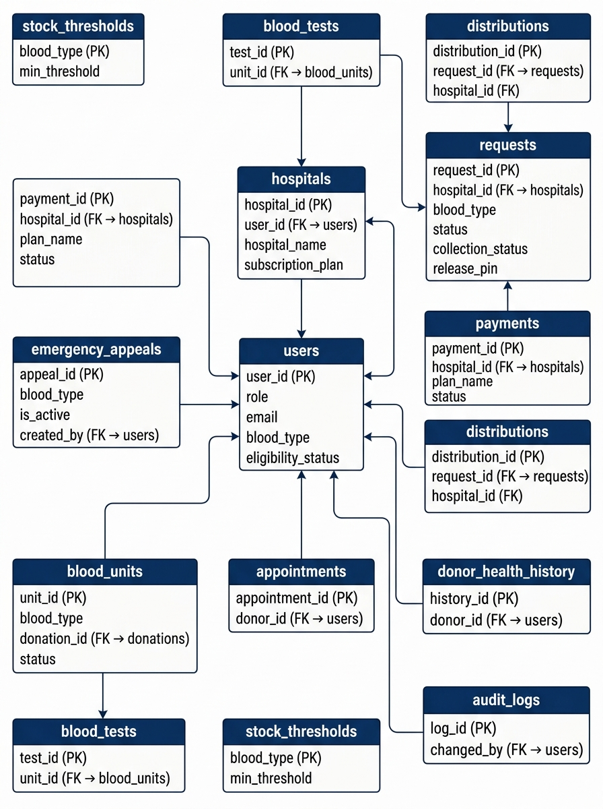

# 🗄️ HemoLink — Database Guide

> **Who is this for?** Anyone who wants to understand the database — what each table stores, how tables relate to each other, and the blood type workflow.

---

## Overview

The database is named `bms_db` and runs on **MySQL**. It has **14 tables** organized around the central `users` table.



---

## All 14 Tables at a Glance

| Table | Purpose |
|---|---|
| `users` | Every user account — admins, hospital managers, and donors all live here |
| `hospitals` | Partner hospitals and clinics |
| `stock_thresholds` | Minimum safe stock levels for each blood type |
| `emergency_appeals` | Active in-app donor mobilization broadcasts |
| `donations` | Each donation event by a donor |
| `blood_units` | Individual bags/units of blood (the actual inventory) |
| `requests` | Blood requisitions submitted by hospitals |
| `request_items` | Line items inside a multi-component request |
| `distributions` | Dispatch and delivery records |
| `payments` | Paystack subscription payment records |
| `appointments` | Donor appointment bookings |
| `blood_tests` | Lab screening results for blood units |
| `donor_health_history` | Vitals and deferral records from health screenings |
| `audit_logs` | Record of every important data change (who changed what and when) |

---

## Table Deep Dives

### `users` — The Central Table

Everything connects to `users`. This single table holds Admin, Hospital Manager, and Donor accounts.

| Column | Type | Notes |
|---|---|---|
| `user_id` | INT (PK) | Auto-incremented unique ID |
| `role` | ENUM | `'Admin'`, `'Hospital'`, or `'Donor'` |
| `username` | VARCHAR(50) | Unique login name |
| `email` | VARCHAR(100) | Unique email address |
| `password_hash` | VARCHAR(255) | Bcrypt hash — never plaintext |
| `first_name` | VARCHAR(50) | — |
| `last_name` | VARCHAR(50) | — |
| `phone` | VARCHAR(20) | Optional |
| `is_active` | BOOLEAN | `1` = active, `0` = suspended |
| `last_login` | TIMESTAMP | Updated on every login |
| `blood_type` | ENUM | Donor only — `'A+'`, `'O-'`, etc. |
| `date_of_birth` | DATE | Donor only |
| `gender` | ENUM | Donor only |
| `address` / `city` | VARCHAR | Donor only |
| `eligibility_status` | ENUM | Donor only — `'Eligible'`, `'Deferred'`, `'Permanently Deferred'` |
| `employee_id` / `department` | VARCHAR | Staff only (future use) |

> 💡 **Why one table?** Having all roles in one table means no JOINs are needed to authenticate a user. Donor-specific columns are simply `NULL` for admins and hospital managers.

---

### `hospitals`

| Column | Notes |
|---|---|
| `hospital_id` | PK |
| `user_id` | FK → `users.user_id` — the manager's account |
| `hospital_name` | Full official name |
| `hospital_code` | Short code (e.g., `KNH-001`) — must be unique |
| `subscription_plan` | `'Starter'`, `'Professional'`, `'Enterprise'` |
| `billing_interval` | `'Monthly'` or `'Annual'` |
| `subscription_expires_at` | When the current plan expires |
| `paystack_customer_code` | Paystack's ID for this hospital (for recurring billing) |

---

### `stock_thresholds`

This is a simple lookup table — one row per blood type.

| Column | Notes |
|---|---|
| `blood_type` | PK — one of the 8 blood types |
| `min_threshold` | Minimum units before the system flags a critical shortage |

**Default values set in `seed.sql`:**

| Blood Type | Min Threshold | Why |
|---|---|---|
| O- | 8 | Universal donor — highest demand |
| O+ | 8 | Most common blood type |
| A+ | 5 | Common |
| B+ | 5 | Common |
| A- | 4 | Less common |
| B- | 4 | Less common |
| AB+ | 3 | Rare |
| AB- | 3 | Rarest |

---

### `emergency_appeals`

When the admin publishes an emergency appeal, a row is inserted here. Donors with the matching blood type see a banner on their dashboard.

| Column | Notes |
|---|---|
| `appeal_id` | PK |
| `blood_type` | Which blood type is needed urgently |
| `urgency` | Label like `'Critical Shortage (Code Red)'` |
| `message` | The appeal text shown to donors |
| `is_active` | `1` = donors can see it, `0` = resolved |
| `created_by` | FK → `users.user_id` (which admin published it) |
| `created_at` | When published |
| `resolved_at` | When ended (NULL if still active) |

---

### `donations`

A donation event — one row per donor visit.

| Column | Notes |
|---|---|
| `donation_id` | PK |
| `donor_id` | FK → `users.user_id` |
| `blood_type` | Blood type donated (confirmed at time of donation) |
| `donation_date` | Date of the visit |
| `volume_ml` | Usually 450ml (standard whole blood unit) |
| `status` | `'Pending'`, `'Completed'`, `'Cancelled'` |
| `donation_center` | Name of the facility |

---

### `blood_units`

The actual inventory — each row is one physical bag of blood.

| Column | Notes |
|---|---|
| `unit_id` | PK |
| `blood_type` | Blood group of this unit |
| `donation_id` | FK → `donations` (which donation this came from) |
| `status` | `'Available'`, `'Reserved'`, `'Dispatched'`, `'Expired'`, `'Quarantined'`, `'Discarded'` |
| `collection_date` | When it was collected/processed |
| `expiry_date` | Whole blood expires ~42 days after collection |
| `volume_ml` | Typically 450ml |

**Unit Status Flow:**
```
Available → Reserved (request being prepared)
Reserved  → Dispatched (sent to hospital)
Any       → Expired (past expiry date)
Any       → Discarded (failed test or contaminated)
```

---

### `requests`

The most feature-rich table — tracks every blood requisition from submission to fulfilment.

| Column | Notes |
|---|---|
| `request_id` | PK |
| `hospital_id` | FK → `hospitals` |
| `blood_type` | Requested blood group |
| `units_requested` | How many units the hospital needs |
| `units_fulfilled` | How many were actually provided |
| `urgency` | `'Normal'`, `'Urgent'`, `'Emergency'` |
| `status` | High-level status (see table below) |
| `collection_status` | Physical collection tracking |
| `release_pin` | 6-digit secure PIN for pickup |
| `pin_generated_at` | Timestamp of PIN creation |
| `collected_at` | When hospital staff picked up |
| `collected_by_name` | Name of the person who collected |
| `collected_by_phone` | Their phone number |
| `dispatched_at` | When dispatched by courier/ambulance |
| `received_at` | When hospital confirmed receipt |
| `temp_verified` | Was cold chain maintained? |

**The two status columns work together:**

| `status` | `collection_status` | Situation |
|---|---|---|
| Pending | Pending | Just submitted |
| Processing | Pending | Admin approved, preparing |
| Processing | Ready for Pickup | Bagged, waiting for hospital |
| Dispatched | Dispatched | En route |
| Fulfilled | Received | Done |
| Rejected | Cancelled | Denied |

---

### `payments`

Records every Paystack transaction (subscription payments).

| Column | Notes |
|---|---|
| `payment_id` | PK |
| `hospital_id` | FK → `hospitals` |
| `reference` | Unique Paystack reference (e.g., `HLK_SUB_2_1710000001`) |
| `amount` | In Kenyan Shillings |
| `plan_name` | `'Starter'`, `'Professional'`, `'Enterprise'` |
| `status` | `'Pending'`, `'Success'`, `'Failed'` |
| `paystack_response` | Full JSON response from Paystack — stored for audit |
| `paid_at` | Timestamp of successful payment |

---

### `appointments`

| Column | Notes |
|---|---|
| `appointment_id` | PK |
| `donor_id` | FK → `users.user_id` |
| `appointment_date` + `appointment_time` | When the appointment is |
| `purpose` | `'Donation'`, `'Health Check'`, `'Consultation'` |
| `status` | `'Scheduled'`, `'Completed'`, `'Cancelled'`, `'No Show'` |

---

### `audit_logs`

Every important change is recorded here for traceability.

| Column | Notes |
|---|---|
| `log_id` | BigInt PK (can have millions of entries) |
| `table_name` | Which table was changed |
| `record_id` | Which row was changed |
| `action` | `'INSERT'`, `'UPDATE'`, `'DELETE'` |
| `old_values` | JSON of the previous values |
| `new_values` | JSON of the new values |
| `changed_by` | FK → `users.user_id` — who made the change |
| `ip_address` | For security forensics |

---

## Blood Type Compatibility Reference

This is useful context for understanding why O- and O+ are the most critical:

| Blood Type | Can Donate To | Can Receive From |
|---|---|---|
| **O-** (Universal Donor) | Everyone | O- only |
| **O+** | O+, A+, B+, AB+ | O+, O- |
| **A-** | A-, A+, AB-, AB+ | A-, O- |
| **A+** | A+, AB+ | A+, A-, O+, O- |
| **B-** | B-, B+, AB-, AB+ | B-, O- |
| **B+** | B+, AB+ | B+, B-, O+, O- |
| **AB-** | AB-, AB+ | AB-, A-, B-, O- |
| **AB+** (Universal Recipient) | AB+ only | Everyone |

This is why O- has the highest safety threshold — it's needed in emergencies when there's no time to determine a patient's blood type.

---

## Setting Up the Database

**Fresh installation:**
```bash
# 1. Create the schema (all tables)
/opt/lampp/bin/mysql -u root bms_db < "BMS SCHEMA.sql"

# 2. Load test data
/opt/lampp/bin/mysql -u root bms_db < seed.sql
```

**Reset to clean state:**
```bash
# The schema file drops all tables before recreating them
/opt/lampp/bin/mysql -u root bms_db < "BMS SCHEMA.sql"
/opt/lampp/bin/mysql -u root bms_db < seed.sql
```

**Test login credentials (after seeding):**

| Role | Email | Password |
|---|---|---|
| Admin | `admin@hemolink.com` | `admin123` |
| Hospital Manager | `manager@knh.go.ke` | `hospital123` |
| Hospital Manager | `manager@agakhan.org` | `hospital123` |
| Donor | `brian.otieno@gmail.com` | `donor123` |
| Donor | `david.odhiambo@gmail.com` | `donor123` |
