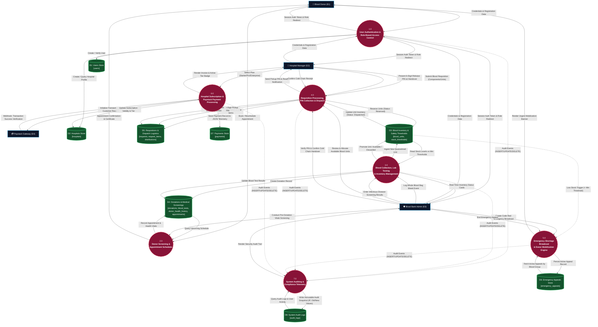
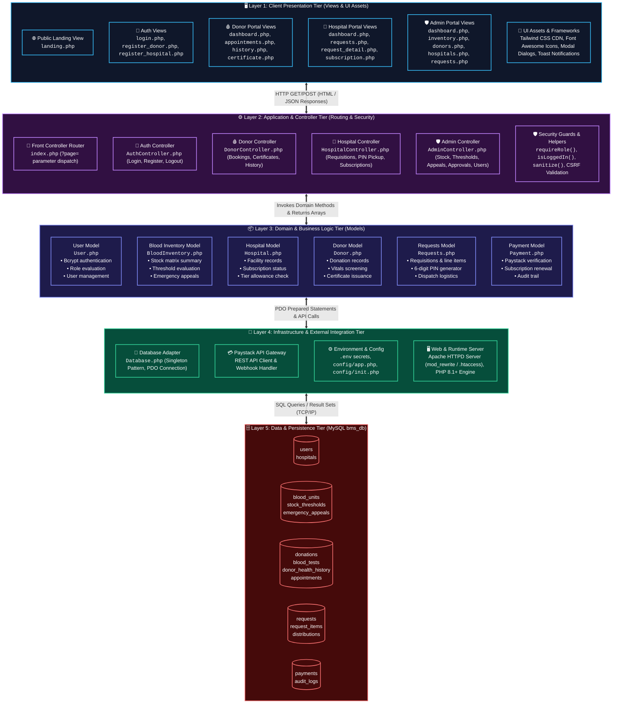

# 📊 HemoLink — System Diagrams & Visual Architecture Specification

> **Document Purpose:** This document provides comprehensive, production-grade technical diagrams for the **HemoLink Blood Bank Management System (BMS)**. It includes formal visual models for system design, database architecture, data flows, user interactions, conceptual layers, and authentication lifecycle.
>
> All diagrams are authored using standard GitHub-compatible **Mermaid.js** syntax and are structured to serve as the definitive technical visual reference for developers, system architects, and stakeholders.

---

## 📑 Table of Contents
1. [1. Entity Relationship Diagram (ERD)](#1-entity-relationship-diagram-erd)
2. [2. Data Flow Diagrams (DFD)](#2-data-flow-diagrams-dfd)
   - [2.1 DFD Level 0 — Context Diagram](#21-dfd-level-0--context-diagram)
   - [2.2 DFD Level 1 — Subsystem Decomposition Diagram](#22-dfd-level-1--subsystem-decomposition-diagram)
3. [3. Use Case Diagram](#3-use-case-diagram)
4. [4. Conceptual Architecture Diagram](#4-conceptual-architecture-diagram)
5. [5. Flowchart Diagram — Authentication & Login Process](#5-flowchart-diagram--authentication--login-process)

---

## 1. Entity Relationship Diagram (ERD)

The HemoLink database (`bms_db`) comprises **14 normalized relational entities** centered around a consolidated `users` identity table with strict foreign key constraints, enumerated data types, and cascading integrity rules.

```mermaid
erDiagram
    %% ==========================================
    %% CORE ENTITIES & RELATIONS
    %% ==========================================
    
    users ||--o| hospitals : "manages/owns (1:1)"
    users ||--o{ emergency_appeals : "publishes (1:N)"
    users ||--o{ donations : "donates (1:N)"
    users ||--o{ appointments : "books (1:N)"
    hospitals ||--o{ appointments : "hosts (1:N)"
    
    donations ||--o{ blood_units : "produces (1:N)"
    blood_units ||--o{ blood_tests : "screened_by (1:N)"
    users ||--o{ blood_tests : "conducts (1:N)"
    
    users ||--o{ donor_health_history : "screened_subject (1:N)"
    users ||--o{ donor_health_history : "examined_by (1:N)"
    donations ||--o| donor_health_history : "associated_with (1:1)"
    
    hospitals ||--o{ requests : "submits (1:N)"
    requests ||--|{ request_items : "contains_components (1:N)"
    requests ||--o{ distributions : "dispatched_as (1:N)"
    hospitals ||--o{ distributions : "receives (1:N)"
    users ||--o{ distributions : "dispatched_by (1:N)"
    
    hospitals ||--o{ payments : "subscribes_via (1:N)"
    users ||--o{ audit_logs : "performed_by (1:N)"

    %% ==========================================
    %% ENTITY DEFINITIONS
    %% ==========================================

    users {
        int user_id PK "AUTO_INCREMENT"
        enum role "Admin, Hospital, Donor"
        varchar username "UNIQUE"
        varchar email "UNIQUE"
        varchar password_hash "Bcrypt hash"
        varchar first_name "First name"
        varchar last_name "Last name"
        varchar phone "Contact phone"
        boolean is_active "1=Active, 0=Suspended"
        timestamp last_login "Last access timestamp"
        enum blood_type "A+, A-, B+, B-, AB+, AB-, O+, O-"
        date date_of_birth "Donor DOB"
        enum gender "Male, Female, Other"
        varchar address "Physical street address"
        varchar city "City/Town"
        enum eligibility_status "Eligible, Deferred, Permanently Deferred"
        varchar employee_id "Staff ID"
        enum department "Collection, Lab, Inventory, Admin, Nursing"
        int hospital_id FK "References hospitals(hospital_id)"
        timestamp created_at "Creation timestamp"
        timestamp updated_at "Update timestamp"
    }

    hospitals {
        int hospital_id PK "AUTO_INCREMENT"
        int user_id FK "References users(user_id) - Manager"
        varchar hospital_name "Full registered facility name"
        varchar hospital_code "UNIQUE identifier code"
        text address "Physical facility address"
        varchar city "City"
        varchar region "State/Region"
        varchar phone "Official facility phone"
        varchar email "Official contact email"
        varchar license_number "MOH Medical license number"
        boolean is_active "1=Active, 0=Disabled"
        enum subscription_plan "Starter, Professional, Enterprise"
        enum billing_interval "Monthly, Annual"
        datetime subscription_expires_at "Expiration datetime"
        varchar paystack_customer_code "Paystack API customer ID"
        timestamp created_at "Creation timestamp"
    }

    stock_thresholds {
        enum blood_type PK "A+, A-, B+, B-, AB+, AB-, O+, O-"
        int min_threshold "Minimum critical safety stock"
        timestamp updated_at "Last threshold update"
    }

    emergency_appeals {
        int appeal_id PK "AUTO_INCREMENT"
        enum blood_type "A+, A-, B+, B-, AB+, AB-, O+, O-"
        varchar urgency "Critical Shortage (Code Red)"
        text message "Mobilization broadcast message"
        boolean is_active "1=Broadcast Active, 0=Resolved"
        int created_by FK "References users(user_id) - Admin"
        timestamp created_at "Broadcast timestamp"
        timestamp resolved_at "Resolution timestamp"
    }

    donations {
        int donation_id PK "AUTO_INCREMENT"
        int donor_id FK "References users(user_id) - Donor"
        enum blood_type "A+, A-, B+, B-, AB+, AB-, O+, O-"
        date donation_date "Date of blood collection"
        int volume_ml "Volume collected (e.g. 450ml)"
        enum status "Pending, Completed, Cancelled"
        varchar donation_center "Facility / Blood Drive center"
        text notes "Staff clinical observations"
        timestamp created_at "Timestamp"
    }

    blood_units {
        int unit_id PK "AUTO_INCREMENT"
        enum blood_type "A+, A-, B+, B-, AB+, AB-, O+, O-"
        int donation_id FK "References donations(donation_id)"
        enum status "Available, Reserved, Dispatched, Expired, Quarantined, Discarded"
        date collection_date "Bleed / collection date"
        date expiry_date "Shelf-life limit (+42 days)"
        int volume_ml "Standard volume (450ml)"
        timestamp created_at "Inventory entry timestamp"
    }

    requests {
        int request_id PK "AUTO_INCREMENT"
        int hospital_id FK "References hospitals(hospital_id)"
        enum blood_type "Requested primary blood group"
        int units_requested "Requested bag count"
        int units_fulfilled "Units actually supplied"
        enum urgency "Normal, Urgent, Emergency"
        enum status "Pending, Processing, Dispatched, Fulfilled, Partially Fulfilled, Rejected, Cancelled"
        enum collection_status "Pending, Ready for Pickup, Dispatched, Collected, Received, Cancelled"
        varchar release_pin "6-digit secure pickup PIN"
        datetime pin_generated_at "PIN generation timestamp"
        datetime collected_at "Handover timestamp"
        varchar collected_by_name "Authorized courier/staff name"
        varchar collected_by_phone "Courier phone number"
        datetime dispatched_at "Dispatch timestamp"
        datetime received_at "Hospital confirmation timestamp"
        boolean temp_verified "Cold chain temperature maintained"
        text notes "Clinical requisition rationale"
        int requested_by FK "References users(user_id)"
        timestamp created_at "Submission timestamp"
    }

    request_items {
        int request_item_id PK "AUTO_INCREMENT"
        int request_id FK "References requests(request_id)"
        enum blood_type "Blood group required"
        enum component "Whole Blood, Red Blood Cells, Platelets, Plasma, Cryoprecipitate"
        int units_requested "Requested component units"
        int units_fulfilled "Fulfilled component units"
        text special_requirements "Irradiated, CMV negative, Leukoreduced"
    }

    distributions {
        int distribution_id PK "AUTO_INCREMENT"
        int request_id FK "References requests(request_id)"
        int hospital_id FK "References hospitals(hospital_id)"
        int dispatched_by FK "References users(user_id) - Staff"
        timestamp dispatched_date "Dispatch timestamp"
        enum transport_method "Hospital Pickup, Ambulance, Courier, Emergency Transport"
        decimal transport_temperature "Monitored temperature in Celsius"
        varchar receiver_name "Hospital recipient nurse/officer"
        varchar receiver_id "Staff ID number"
        int receiver_signature "Digital signature reference"
        boolean is_delivered "Delivery verification flag"
        timestamp delivered_at "Delivery confirmation timestamp"
    }

    payments {
        int payment_id PK "AUTO_INCREMENT"
        int hospital_id FK "References hospitals(hospital_id)"
        varchar reference "UNIQUE Paystack transaction reference"
        decimal amount "Billed amount in KES"
        varchar currency "KES"
        enum plan_name "Starter, Professional, Enterprise"
        enum billing_interval "Monthly, Annual"
        varchar channel "card, mobile_money, bank"
        enum status "Pending, Success, Failed"
        longtext paystack_response "Full JSON audit log from Paystack"
        datetime paid_at "Payment verification timestamp"
        timestamp created_at "Created timestamp"
    }

    appointments {
        int appointment_id PK "AUTO_INCREMENT"
        int donor_id FK "References users(user_id) - Donor"
        int hospital_id FK "References hospitals(hospital_id)"
        date appointment_date "Scheduled appointment date"
        time appointment_time "Scheduled appointment time"
        enum purpose "Donation, Health Check, Consultation"
        enum status "Scheduled, Completed, Cancelled, No Show"
        text notes "Appointment notes"
        timestamp created_at "Booking timestamp"
    }

    blood_tests {
        int test_id PK "AUTO_INCREMENT"
        int unit_id FK "References blood_units(unit_id)"
        date test_date "Lab testing date"
        int tested_by FK "References users(user_id) - Lab Tech"
        enum hiv_result "Negative, Positive, Indeterminate"
        enum hepatitis_b "Negative, Positive, Indeterminate"
        enum hepatitis_c "Negative, Positive, Indeterminate"
        enum syphilis "Negative, Positive, Indeterminate"
        enum malaria "Negative, Positive, Indeterminate"
        boolean blood_group_verified "ABO/Rh re-test confirmed"
        boolean is_approved "Lab release authorization"
        int approved_by FK "References users(user_id)"
        timestamp created_at "Test record timestamp"
    }

    donor_health_history {
        int history_id PK "AUTO_INCREMENT"
        int donor_id FK "References users(user_id) - Donor"
        int donation_id FK "References donations(donation_id)"
        int checked_by FK "References users(user_id) - Nurse"
        date check_date "Screening date"
        decimal weight_kg "Donor body weight in kg"
        int blood_pressure_systolic "Systolic mmHg"
        int blood_pressure_diastolic "Diastolic mmHg"
        int pulse_rate "Heart rate BPM"
        decimal temperature "Body temp in Celsius"
        decimal hemoglobin_level "Hb level g/dL"
        boolean has_medical_condition "Underlying conditions"
        boolean is_deferred "Temporary/Permanent deferral"
        int deferral_period_days "Days deferred"
        text deferral_reason "Clinical rationale for deferral"
        boolean doctor_clearance "Doctor signed clearance"
    }

    audit_logs {
        bigint log_id PK "AUTO_INCREMENT"
        varchar table_name "Mutated table name"
        int record_id "Target row ID"
        enum action "INSERT, UPDATE, DELETE"
        json old_values "Pre-mutation state snapshot"
        json new_values "Post-mutation state snapshot"
        int changed_by FK "References users(user_id)"
        timestamp changed_at "Event timestamp"
        varchar ip_address "Client IPv4/IPv6"
        text user_agent "Client browser fingerprint"
    }
```



---

## 2. Data Flow Diagrams (DFD)

### 2.1 DFD Level 0 — Context Diagram

The Context Diagram defines the external boundary of the **HemoLink System (0.0)** and all high-level information exchanges with external entities: **Blood Donors**, **Hospital Managers**, **Blood Bank Administrators**, and the **Paystack Payment Gateway**.

```mermaid
flowchart TD
    %% External Entities
    DONOR["👤 Blood Donor (E1)"]
    HOSPITAL["🏥 Hospital Manager (E2)"]
    ADMIN["🛡️ Blood Bank Admin (E3)"]
    PAYSTACK["💳 Paystack Gateway (E4)"]

    %% Central System Process
    SYSTEM(("0.0<br/><b>HemoLink Blood Bank<br/>Management System</b>"))

    %% Flows: Donor <--> System
    DONOR -- "1. Donor Registration & Vitals Profile" --> SYSTEM
    DONOR -- "2. Appointment Booking / Reschedule Request" --> SYSTEM
    DONOR -- "3. Emergency Appeal Response" --> SYSTEM
    SYSTEM -- "A. Appointment Confirmation & Reminders" --> DONOR
    SYSTEM -- "B. Blood Donation History & Badges" --> DONOR
    SYSTEM -- "C. Printable Donation Certificate" --> DONOR
    SYSTEM -- "D. Code Red / Emergency Blood Shortage Alerts" --> DONOR

    %% Flows: Hospital <--> System
    HOSPITAL -- "4. Hospital Registration & MOH License" --> SYSTEM
    HOSPITAL -- "5. Blood Requisition (Components, Urgency, Units)" --> SYSTEM
    HOSPITAL -- "6. 6-Digit Pickup Release PIN Presentation" --> SYSTEM
    HOSPITAL -- "7. Cold Chain Receipt & Delivery Confirmation" --> SYSTEM
    HOSPITAL -- "8. Subscription Plan Selection & Billing Interval" --> SYSTEM
    SYSTEM -- "E. Requisition Status & Fulfillment Timeline" --> HOSPITAL
    SYSTEM -- "F. Secure 6-Digit Collection Release PIN" --> HOSPITAL
    SYSTEM -- "G. Dispatch Tracking & Cold Chain Logs" --> HOSPITAL
    SYSTEM -- "H. Subscription Invoices & Plan Status" --> HOSPITAL

    %% Flows: Admin <--> System
    ADMIN -- "9. Stock Inventory Ingestion & Expiry Updates" --> SYSTEM
    ADMIN -- "10. Configurable Safety Stock Thresholds" --> SYSTEM
    ADMIN -- "11. Emergency Appeal Broadcast Activation/Resolution" --> SYSTEM
    ADMIN -- "12. Requisition Review, Stock Allocation & PIN Validation" --> SYSTEM
    ADMIN -- "13. Lab Screening Results & Unit Release/Quarantine" --> SYSTEM
    ADMIN -- "14. User Account Moderation & Status Toggle" --> SYSTEM
    SYSTEM -- "I. Real-Time Blood Stock Matrix & Low-Stock Alerts" --> ADMIN
    SYSTEM -- "J. Requisition Queue & Verification Telemetry" --> ADMIN
    SYSTEM -- "K. Immutable Audit Logs & Security Forensic Feed" --> ADMIN
    SYSTEM -- "L. Donor Demographics & Hospital Requisition Analytics" --> ADMIN

    %% Flows: System <--> Paystack
    SYSTEM -- "15. Payment Initialization (Amount, Customer Code, Reference)" --> PAYSTACK
    PAYSTACK -- "M. Webhook Verification (charge.success, Reference, Status)" --> SYSTEM

    %% Styling
    classDef entity fill:#1e293b,stroke:#94a3b8,stroke-width:2px,color:#ffffff;
    classDef process fill:#991b1b,stroke:#f87171,stroke-width:3px,color:#ffffff;
    class DONOR,HOSPITAL,ADMIN,PAYSTACK entity;
    class SYSTEM process;
```



---

### 2.2 DFD Level 1 — Subsystem Decomposition Diagram

The Level 1 DFD decomposes the central process into **7 core functional processes** interacting with **8 dedicated data stores**.



---

## 3. Use Case Diagram

```mermaid
graph LR
    %% Actors
    GUEST(("🌐 Public Visitor"))
    DONOR(("🩸 Blood Donor"))
    HOSPITAL(("🏥 Hospital Manager"))
    ADMIN(("🛡️ Blood Bank Admin"))
    PAYSTACK(("💳 Paystack Gateway"))

    %% Subsystems / Boundaries
    subgraph HemoLink_System ["🏥 HemoLink Blood Bank Management System"]
        
        %% Auth Subsystem
        subgraph Auth_Module ["🔐 Authentication & Identity Subsystem"]
            UC_RegDonor["Register as Donor"]
            UC_RegHosp["Register Hospital Account"]
            UC_Login["Log In to Account"]
            UC_VerifyCreds["<<include>> Verify Bcrypt Password"]
            UC_RoleRoute["<<include>> Route by Role"]
            UC_Logout["Log Out / Destroy Session"]
            
            UC_Login -.->|includes| UC_VerifyCreds
            UC_Login -.->|includes| UC_RoleRoute
        end

        %% Donor Subsystem
        subgraph Donor_Portal ["🩸 Donor Services Portal"]
            UC_DonorDash["View Personal Dashboard"]
            UC_BookAppt["Book / Reschedule Appointment"]
            UC_ViewAppeals["View Emergency Blood Appeals"]
            UC_UrgentBook["<<extend>> Book Urgent Donation"]
            UC_DonHistory["View Blood Donation History"]
            UC_DownloadCert["Download Donation Certificate"]
            UC_EditProfile["Update Contact & Location Profile"]

            UC_ViewAppeals -.->|extends| UC_UrgentBook
        end

        %% Hospital Subsystem
        subgraph Hospital_Portal ["🏥 Hospital Operations Portal"]
            UC_HospDash["View Requisition Dashboard"]
            UC_NewRequest["Submit Blood Requisition"]
            UC_AddItems["<<include>> Specify Component Line Items"]
            UC_TrackReq["Track Requisition Timeline & Status"]
            UC_ViewPIN["Retrieve 6-Digit Collection PIN"]
            UC_ConfirmReceipt["Confirm Blood Receipt & Cold Chain"]
            UC_ManageSub["Manage Subscription Plan"]
            UC_PaystackCheckout["<<include>> Checkout via Paystack"]

            UC_NewRequest -.->|includes| UC_AddItems
            UC_TrackReq -.->|includes| UC_ViewPIN
            UC_ManageSub -.->|includes| UC_PaystackCheckout
        end

        %% Admin Subsystem
        subgraph Admin_Portal ["🛡️ Blood Bank Administration Portal"]
            UC_AdminDash["Monitor Central Inventory Matrix"]
            UC_AddStock["Ingest Blood Units & Set Expiry"]
            UC_SetThresholds["Configure Safety Stock Thresholds"]
            UC_BroadcastAppeal["Broadcast Emergency Blood Appeal"]
            UC_EndAppeal["Resolve Active Emergency Appeal"]
            UC_ReviewReq["Review & Approve Blood Requests"]
            UC_PrepareUnits["<<include>> Allocate & Reserve Units"]
            UC_GeneratePIN["<<include>> Generate Pickup PIN"]
            UC_VerifyPIN["Verify Pickup PIN at Handover"]
            UC_DispatchCourier["Dispatch Units with Transport Courier"]
            UC_LabTesting["Record Lab Screening & Infection Markers"]
            UC_ReleaseQuarantine["Release / Discard Blood Units"]
            UC_ManageDonors["Manage Donor Profiles & Deferral Status"]
            UC_AuditTrail["Inspect Immutable Audit Trail & Logs"]

            UC_ReviewReq -.->|includes| UC_PrepareUnits
            UC_ReviewReq -.->|includes| UC_GeneratePIN
            UC_LabTesting -.->|includes| UC_ReleaseQuarantine
        end
    end

    %% Actor to Use Case Connections
    GUEST --> UC_RegDonor
    GUEST --> UC_RegHosp
    GUEST --> UC_Login

    DONOR --> UC_Login
    DONOR --> UC_Logout
    DONOR --> UC_DonorDash
    DONOR --> UC_BookAppt
    DONOR --> UC_ViewAppeals
    DONOR --> UC_DonHistory
    DONOR --> UC_DownloadCert
    DONOR --> UC_EditProfile

    HOSPITAL --> UC_Login
    HOSPITAL --> UC_Logout
    HOSPITAL --> UC_HospDash
    HOSPITAL --> UC_NewRequest
    HOSPITAL --> UC_TrackReq
    HOSPITAL --> UC_ConfirmReceipt
    HOSPITAL --> UC_ManageSub

    ADMIN --> UC_Login
    ADMIN --> UC_Logout
    ADMIN --> UC_AdminDash
    ADMIN --> UC_AddStock
    ADMIN --> UC_SetThresholds
    ADMIN --> UC_BroadcastAppeal
    ADMIN --> UC_EndAppeal
    ADMIN --> UC_ReviewReq
    ADMIN --> UC_VerifyPIN
    ADMIN --> UC_DispatchCourier
    ADMIN --> UC_LabTesting
    ADMIN --> UC_ManageDonors
    ADMIN --> UC_AuditTrail

    UC_PaystackCheckout <--> PAYSTACK

    %% Styling
    classDef actorStyle fill:#1e1b4b,stroke:#818cf8,stroke-width:2px,color:#ffffff;
    classDef ucStyle fill:#0f172a,stroke:#38bdf8,stroke-width:1.5px,color:#f8fafc;
    class GUEST,DONOR,HOSPITAL,ADMIN,PAYSTACK actorStyle;
    class UC_RegDonor,UC_RegHosp,UC_Login,UC_VerifyCreds,UC_RoleRoute,UC_Logout,UC_DonorDash,UC_BookAppt,UC_ViewAppeals,UC_UrgentBook,UC_DonHistory,UC_DownloadCert,UC_EditProfile,UC_HospDash,UC_NewRequest,UC_AddItems,UC_TrackReq,UC_ViewPIN,UC_ConfirmReceipt,UC_ManageSub,UC_PaystackCheckout,UC_AdminDash,UC_AddStock,UC_SetThresholds,UC_BroadcastAppeal,UC_EndAppeal,UC_ReviewReq,UC_PrepareUnits,UC_GeneratePIN,UC_VerifyPIN,UC_DispatchCourier,UC_LabTesting,UC_ReleaseQuarantine,UC_ManageDonors,UC_AuditTrail ucStyle;
```

The Use Case model maps user actors (**Blood Donor**, **Hospital Manager**, **Blood Bank Admin**, and **Public Visitor**) and system actors (**Paystack Gateway**) to functional use cases with explicit `<<include>>` and `<<extend>>` dependencies.



---

## 4. Conceptual Architecture Diagram

HemoLink is architected using a modular **Multi-Tier Model-View-Controller (MVC)** design pattern, separating client presentation, routing/controller orchestration, domain models, infrastructure adapters, and persistent database storage.



---

## 5. Flowchart Diagram — Authentication & Login Process

This flowchart maps the exact control and data flow executed during user authentication across `index.php`, `AuthController::login()`, and `User::login()`, including input sanitization, database queries, password verification, session initialization, and role-based redirect logic.

```mermaid
flowchart TD
    %% Start
    START([🏁 User Accesses Login Page]) --> NAV["HTTP GET /index.php?page=login"]
    
    %% Check existing session
    NAV --> CHECK_SESSION{Is User Already<br/>Logged In?<br/><code>isLoggedIn()</code>}
    CHECK_SESSION -- "Yes" --> REDIRECT_ROLE["Invoke redirectToDashboard()"]
    REDIRECT_ROLE --> ROLE_SWITCH_ACTIVE{Evaluate<br/><code>$_SESSION['role']</code>}
    ROLE_SWITCH_ACTIVE -- "Admin" --> GOTO_ADMIN["Redirect: ?page=admin_dashboard"]
    ROLE_SWITCH_ACTIVE -- "Hospital" --> GOTO_HOSP["Redirect: ?page=hospital_dashboard"]
    ROLE_SWITCH_ACTIVE -- "Donor" --> GOTO_DONOR["Redirect: ?page=donor_dashboard"]
    
    %% Render Login View
    CHECK_SESSION -- "No" --> RENDER_LOGIN["Render <code>views/auth/login.php</code><br/>(Display Form & Flash Errors)"]
    
    %% User Submission
    RENDER_LOGIN --> USER_SUBMIT["User Enters Email & Password<br/>Clicks 'Sign In' Button"]
    USER_SUBMIT --> POST_REQ["HTTP POST /index.php?page=login_process"]
    
    %% Router Dispatch
    POST_REQ --> ROUTER["<code>index.php</code> Front Controller<br/>Dispatches to <code>AuthController->login()</code>"]
    
    %% Request Method Check
    ROUTER --> CHECK_METHOD{Is Request<br/>Method == POST?}
    CHECK_METHOD -- "No" --> REDIRECT_GET["redirect('login')"] --> RENDER_LOGIN
    
    %% Input Sanitization & Validation
    CHECK_METHOD -- "Yes" --> SANITIZE["Sanitize Input:<br/><code>$email = sanitize($_POST['email'])</code><br/><code>$password = $_POST['password']</code>"]
    SANITIZE --> VALIDATE_INPUT{Are Email & Password<br/>both non-empty?}
    
    VALIDATE_INPUT -- "No (Validation Failed)" --> SET_VALID_ERR["Set $_SESSION['errors'] = ['Email/Password is required']<br/>Set $_SESSION['old_input'] = ['email' => $email]"]
    SET_VALID_ERR --> FLASH_REDIRECT["redirect('login')"] --> RENDER_LOGIN
    
    %% Database Lookup
    VALIDATE_INPUT -- "Yes" --> CALL_MODEL["Call <code>$this->userModel->login($email, $password)</code>"]
    CALL_MODEL --> DB_QUERY["Execute PDO Prepared Statement:<br/><code>SELECT * FROM users WHERE email = :email AND is_active = 1</code>"]
    
    DB_QUERY --> USER_EXISTS{Active User Record<br/>Found in Database?}
    
    USER_EXISTS -- "No (User Not Found or Inactive)" --> AUTH_FAIL["Set $_SESSION['errors'] = ['Invalid email or password']<br/>Set $_SESSION['old_input'] = ['email' => $email]"]
    AUTH_FAIL --> REDIRECT_FAIL["redirect('login')"] --> RENDER_LOGIN
    
    %% Password Hash Verification
    USER_EXISTS -- "Yes" --> BCRYPT_VERIFY{"Verify Password Hash:<br/><code>password_verify($password, $user['password_hash'])</code>"}
    
    BCRYPT_VERIFY -- "False (Password Mismatch)" --> AUTH_FAIL
    
    %% Successful Authentication
    BCRYPT_VERIFY -- "True (Password Verified)" --> UPDATE_LOGIN["Execute: <code>UPDATE users SET last_login = NOW() WHERE user_id = :user_id</code>"]
    UPDATE_LOGIN --> RETURN_USER["Return $user array to AuthController"]
    
    %% Session Initialization
    RETURN_USER --> INIT_SESSION["Initialize PHP Session Variables:<br/>• <code>$_SESSION['user_id'] = $user['user_id']</code><br/>• <code>$_SESSION['role'] = $user['role']</code><br/>• <code>$_SESSION['username'] = $user['username']</code><br/>• <code>$_SESSION['first_name'] = $user['first_name']</code><br/>• <code>$_SESSION['last_name'] = $user['last_name']</code><br/>• <code>$_SESSION['email'] = $user['email']</code>"]
    
    %% Role-Based Routing
    INIT_SESSION --> ROUTE_ROLE["Invoke <code>redirectToDashboard()</code>"]
    ROUTE_ROLE --> ROLE_CHECK{Check <code>getUserRole()</code>}
    
    ROLE_CHECK -- "ROLE_ADMIN ('Admin')" --> REDIRECT_ADMIN["<code>redirect('admin_dashboard')</code>"]
    ROLE_CHECK -- "ROLE_HOSPITAL ('Hospital')" --> REDIRECT_HOSP["<code>redirect('hospital_dashboard')</code>"]
    ROLE_CHECK -- "ROLE_DONOR ('Donor')" --> REDIRECT_DONOR["<code>redirect('donor_dashboard')</code>"]
    ROLE_CHECK -- "Unknown / Invalid" --> REDIRECT_FALLBACK["<code>redirect('login')</code>"] --> RENDER_LOGIN
    
    %% Terminal States
    REDIRECT_ADMIN --> ADMIN_VIEW(["🎉 Admin Dashboard Displayed<br/><code>views/admin/dashboard.php</code>"])
    REDIRECT_HOSP --> HOSP_VIEW(["🎉 Hospital Dashboard Displayed<br/><code>views/hospital/dashboard.php</code>"])
    REDIRECT_DONOR --> DONOR_VIEW(["🎉 Donor Dashboard Displayed<br/><code>views/donor/dashboard.php</code>"])
    GOTO_ADMIN --> ADMIN_VIEW
    GOTO_HOSP --> HOSP_VIEW
    GOTO_DONOR --> DONOR_VIEW

    %% Styling
    classDef startEnd fill:#0f172a,stroke:#38bdf8,stroke-width:2px,color:#ffffff;
    classDef process fill:#1e1b4b,stroke:#818cf8,stroke-width:1.5px,color:#ffffff;
    classDef decision fill:#881337,stroke:#fb7185,stroke-width:2px,color:#ffffff;
    classDef success fill:#064e3b,stroke:#34d399,stroke-width:2px,color:#ffffff;
    classDef failure fill:#7f1d1d,stroke:#f87171,stroke-width:1.5px,color:#ffffff;

    class START,ADMIN_VIEW,HOSP_VIEW,DONOR_VIEW startEnd;
    class NAV,REDIRECT_ROLE,RENDER_LOGIN,USER_SUBMIT,POST_REQ,ROUTER,SANITIZE,CALL_MODEL,DB_QUERY,UPDATE_LOGIN,RETURN_USER,INIT_SESSION,ROUTE_ROLE,REDIRECT_ADMIN,REDIRECT_HOSP,REDIRECT_DONOR,REDIRECT_FALLBACK,GOTO_ADMIN,GOTO_HOSP,GOTO_DONOR process;
    class CHECK_SESSION,ROLE_SWITCH_ACTIVE,CHECK_METHOD,VALIDATE_INPUT,USER_EXISTS,BCRYPT_VERIFY,ROLE_CHECK decision;
    class SET_VALID_ERR,FLASH_REDIRECT,AUTH_FAIL,REDIRECT_FAIL,REDIRECT_GET failure;
```

---

## 📌 Summary of Architecture & Technical Specifications

| Specification Area | Architectural Decision | Technical Rationale |
|---|---|---|
| **Architecture Pattern** | Model-View-Controller (MVC) with Front Controller | Single entry point (`index.php`) isolates routing logic and separates Presentation, Domain Logic, and Data Persistence layers. |
| **Authentication & RBAC** | Consolidated `users` table with ENUM role | Single database lookup for authentication (`O(1)` query without JOINs); Bcrypt hashing with random salt for credential protection. |
| **Data Integrity & Schema** | 14 Relational Tables with InnoDB Foreign Keys | Enforces referential integrity on deletions/cascades; supports multi-component requisitions, cold chain tracking, and audit snapshots. |
| **Logistics & Collection** | Dual Status Tracking + 6-Digit Pickup Release PIN | `status` (clinical lifecycle) and `collection_status` (physical custody) prevent premature dispatch; cryptographic 6-digit PIN validates physical handover. |
| **Payment & Billing** | Paystack REST API Gateway with Webhook Verification | Asynchronous webhook handling for recurring subscription tiers (Starter, Professional, Enterprise) with raw JSON payloads logged for auditing. |
| **Safety Thresholds & Appeals** | Configurable Minimum Stock + Broadcast Mobilization Engine | Dynamic threshold lookup per blood group triggers critical Code Red alerts and filters broadcasts strictly to matching donors. |

