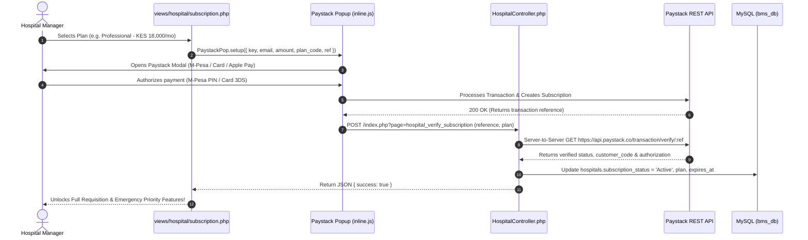
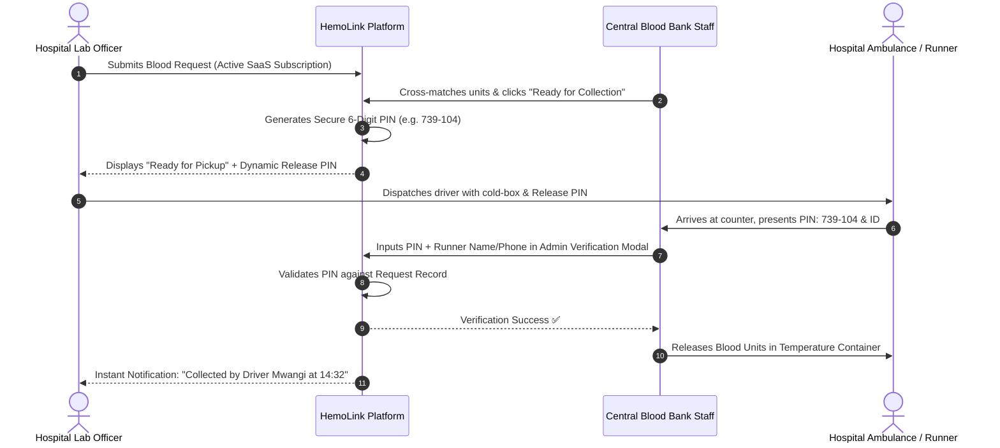
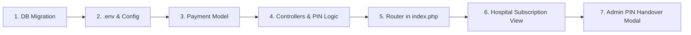

# HemoLink - Paystack SaaS Subscription & "Click & Collect" Integration Guide
## Complete Technical Implementation for Recurring Hospital Subscriptions & Secure Digital Release PINs

---

## 1. System Architecture & Workflows

HemoLink’s commercial engine combines **Paystack SaaS Recurring Subscriptions** with a **Click & Collect Digital Release PIN** protocol.



---

## 2. Click & Collect Handover Sequence (With Digital Release PIN)



---

## 3. Step-by-Step Implementation Guide



---

### Step 1: Database Migration (SQL)

Run the following SQL migration in `bms_db` to set up subscription management and Click & Collect fields:

```sql
USE `bms_db`;

-- 1. Create payments / subscription transactions ledger
CREATE TABLE IF NOT EXISTS `payments` (
    `payment_id` INT AUTO_INCREMENT PRIMARY KEY,
    `hospital_id` INT NOT NULL,
    `reference` VARCHAR(100) NOT NULL UNIQUE,
    `amount` DECIMAL(10, 2) NOT NULL,
    `currency` VARCHAR(10) NOT NULL DEFAULT 'KES',
    `plan_name` ENUM('Starter', 'Professional', 'Enterprise') NOT NULL,
    `billing_interval` ENUM('Monthly', 'Annual') DEFAULT 'Monthly',
    `channel` VARCHAR(50) NULL COMMENT 'card, mobile_money, bank, etc.',
    `status` ENUM('Pending', 'Success', 'Failed') DEFAULT 'Pending',
    `paystack_response` JSON NULL,
    `paid_at` DATETIME NULL,
    `created_at` TIMESTAMP DEFAULT CURRENT_TIMESTAMP,
    FOREIGN KEY (`hospital_id`) REFERENCES `hospitals`(`hospital_id`) ON DELETE CASCADE
) ENGINE=InnoDB DEFAULT CHARSET=utf8mb4;

-- 2. Add SaaS Subscription fields to hospitals table
ALTER TABLE `hospitals` 
ADD COLUMN IF NOT EXISTS `subscription_status` ENUM('Trial', 'Active', 'Expired', 'Cancelled') DEFAULT 'Trial' AFTER `is_verified`,
ADD COLUMN IF NOT EXISTS `subscription_plan` ENUM('Starter', 'Professional', 'Enterprise') DEFAULT 'Starter' AFTER `subscription_status`,
ADD COLUMN IF NOT EXISTS `billing_interval` ENUM('Monthly', 'Annual') DEFAULT 'Monthly' AFTER `subscription_plan`,
ADD COLUMN IF NOT EXISTS `subscription_expires_at` DATETIME NULL AFTER `billing_interval`,
ADD COLUMN IF NOT EXISTS `paystack_customer_code` VARCHAR(100) NULL AFTER `subscription_expires_at`;

-- 3. Add Click & Collect Digital Release PIN fields to requests table
ALTER TABLE `requests`
ADD COLUMN IF NOT EXISTS `collection_status` ENUM('Pending', 'Ready for Pickup', 'Collected', 'Cancelled') DEFAULT 'Pending' AFTER `status`,
ADD COLUMN IF NOT EXISTS `release_pin` VARCHAR(10) NULL AFTER `collection_status`,
ADD COLUMN IF NOT EXISTS `pin_generated_at` DATETIME NULL AFTER `release_pin`,
ADD COLUMN IF NOT EXISTS `collected_at` DATETIME NULL AFTER `pin_generated_at`,
ADD COLUMN IF NOT EXISTS `collected_by_name` VARCHAR(100) NULL AFTER `collected_at`,
ADD COLUMN IF NOT EXISTS `collected_by_phone` VARCHAR(30) NULL AFTER `collected_by_name`;
```

---

### Step 2: Environment Configuration & Keys

#### 2.1 Update `.env`
Add your Paystack API credentials and plan pricing constants to `/.env`:

```ini
DB_HOST=localhost
DB_USER=root
DB_PASS=
DB_NAME=bms_db

# Paystack API Credentials (From Paystack Dashboard > Settings > API Keys)
PAYSTACK_PUBLIC_KEY=pk_test_xxxxxxxxxxxxxxxxxxxxxxxxxxxxxxxxxxxxxxxx
PAYSTACK_SECRET_KEY=sk_test_xxxxxxxxxxxxxxxxxxxxxxxxxxxxxxxxxxxxxxxx
PAYSTACK_CURRENCY=KES

# SaaS Subscription Pricing (in KES)
PLAN_STARTER_MONTHLY=6000
PLAN_PRO_MONTHLY=18000
PLAN_ENTERPRISE_MONTHLY=45000
```

#### 2.2 Update `config/app.php`
Add the SaaS plan definitions in [`config/app.php`](file:///opt/lampp/htdocs/Blood-Bank-Management-System/config/app.php):

```php
// Paystack & Subscription Configuration
$envPath = __DIR__ . '/../.env';
if (file_exists($envPath)) {
    $env = parse_ini_file($envPath);
    define('PAYSTACK_PUBLIC_KEY', $env['PAYSTACK_PUBLIC_KEY'] ?? '');
    define('PAYSTACK_SECRET_KEY', $env['PAYSTACK_SECRET_KEY'] ?? '');
    define('PAYSTACK_CURRENCY', $env['PAYSTACK_CURRENCY'] ?? 'KES');

    // SaaS Plan Prices
    define('PLANS', [
        'Starter' => [
            'name'        => 'Starter (Clinic)',
            'monthly'     => (float)($env['PLAN_STARTER_MONTHLY'] ?? 6000),
            'annual'      => (float)($env['PLAN_STARTER_MONTHLY'] ?? 6000) * 12 * 0.85,
            'max_req'     => 15,
            'emergency'   => false,
        ],
        'Professional' => [
            'name'        => 'Professional (Hospital)',
            'monthly'     => (float)($env['PLAN_PRO_MONTHLY'] ?? 18000),
            'annual'      => (float)($env['PLAN_PRO_MONTHLY'] ?? 18000) * 12 * 0.85,
            'max_req'     => 'Unlimited',
            'emergency'   => true,
        ],
        'Enterprise' => [
            'name'        => 'Enterprise (Network)',
            'monthly'     => (float)($env['PLAN_ENTERPRISE_MONTHLY'] ?? 45000),
            'annual'      => (float)($env['PLAN_ENTERPRISE_MONTHLY'] ?? 45000) * 12 * 0.85,
            'max_req'     => 'Unlimited',
            'emergency'   => true,
        ],
    ]);
}
```

---

### Step 3: Create Payment Model (`models/Payment.php`)

Create [`models/Payment.php`](file:///opt/lampp/htdocs/Blood-Bank-Management-System/models/Payment.php) for server-side verification and subscription tracking:

```php
<?php
/**
 * Payment Model
 * Handles Paystack API verification and hospital SaaS subscription lifecycle
 */
class Payment {
    private $db;

    public function __construct() {
        $this->db = Database::getInstance()->getConnection();
    }

    /**
     * Verify transaction reference with Paystack REST API
     */
    public function verifyPaystackReference($reference) {
        $secretKey = PAYSTACK_SECRET_KEY;
        $url = "https://api.paystack.co/transaction/verify/" . rawurlencode($reference);

        $ch = curl_init();
        curl_setopt($ch, CURLOPT_URL, $url);
        curl_setopt($ch, CURLOPT_RETURNTRANSFER, true);
        curl_setopt($ch, CURLOPT_HTTPHEADER, [
            "Authorization: Bearer " . $secretKey,
            "Cache-Control: no-cache",
        ]);
        curl_setopt($ch, CURLOPT_SSL_VERIFYPEER, true);

        $response = curl_exec($ch);
        $err = curl_error($ch);
        curl_close($ch);

        if ($err) {
            return ['status' => false, 'message' => 'cURL Error: ' . $err];
        }

        return json_decode($response, true);
    }

    /**
     * Record successful subscription and update hospital status
     */
    public function activateHospitalSubscription($hospitalId, $reference, $planName, $interval, $amount, $channel, $paystackData) {
        $this->db->beginTransaction();
        try {
            // 1. Insert transaction log
            $sql = "INSERT INTO payments (hospital_id, reference, amount, currency, plan_name, billing_interval, channel, status, paystack_response, paid_at)
                    VALUES (:hid, :ref, :amount, :currency, :plan, :interval, :channel, 'Success', :resp, NOW())";
            $stmt = $this->db->prepare($sql);
            $stmt->execute([
                'hid'      => $hospitalId,
                'ref'      => $reference,
                'amount'   => $amount,
                'currency' => PAYSTACK_CURRENCY,
                'plan'     => $planName,
                'interval' => $interval,
                'channel'  => $channel,
                'resp'     => json_encode($paystackData),
            ]);

            // 2. Calculate expiration date (+30 days or +365 days)
            $daysToAdd = ($interval === 'Annual') ? 365 : 30;
            $expiresAt = date('Y-m-d H:i:s', strtotime("+{$daysToAdd} days"));
            $customerCode = $paystackData['customer']['customer_code'] ?? null;

            // 3. Update hospital subscription record
            $sqlHosp = "UPDATE hospitals SET 
                        subscription_status = 'Active',
                        subscription_plan = :plan,
                        billing_interval = :interval,
                        subscription_expires_at = :expires_at,
                        paystack_customer_code = :cust_code,
                        updated_at = NOW()
                        WHERE hospital_id = :hid";
            $stmtHosp = $this->db->prepare($sqlHosp);
            $stmtHosp->execute([
                'plan'       => $planName,
                'interval'   => $interval,
                'expires_at' => $expiresAt,
                'cust_code'  => $customerCode,
                'hid'        => $hospitalId,
            ]);

            $this->db->commit();
            return true;
        } catch (Exception $e) {
            $this->db->rollBack();
            error_log('Subscription Activation Error: ' . $e->getMessage());
            return false;
        }
    }
}
```

Include in [`config/init.php`](file:///opt/lampp/htdocs/Blood-Bank-Management-System/config/init.php):
```php
require_once __DIR__ . '/../models/Payment.php';
```

---

### Step 4: Controller Updates

#### 4.1 `controllers/HospitalController.php` (Subscription & Release PIN View)
Add these methods in [`controllers/HospitalController.php`](file:///opt/lampp/htdocs/Blood-Bank-Management-System/controllers/HospitalController.php):

```php
/**
 * Show subscription pricing page
 */
public function subscription() {
    requireRole(ROLE_HOSPITAL);
    $hospital = $this->getMyHospital();
    $plans = PLANS;
    $pageTitle = 'Subscription Plans';
    require_once __DIR__ . '/../views/hospital/subscription.php';
}

/**
 * Verify Paystack subscription callback (AJAX)
 */
public function verifySubscription() {
    requireRole(ROLE_HOSPITAL);
    header('Content-Type: application/json');

    if ($_SERVER['REQUEST_METHOD'] !== 'POST') {
        echo json_encode(['success' => false, 'message' => 'Invalid request method']);
        exit;
    }

    $reference = trim($_POST['reference'] ?? '');
    $planName  = trim($_POST['plan_name'] ?? 'Professional');
    $interval  = trim($_POST['interval'] ?? 'Monthly');

    if (empty($reference)) {
        echo json_encode(['success' => false, 'message' => 'Missing transaction reference']);
        exit;
    }

    $hospital = $this->getMyHospital();
    if (!$hospital) {
        echo json_encode(['success' => false, 'message' => 'Hospital profile not found']);
        exit;
    }

    $paymentModel = new Payment();
    $result = $paymentModel->verifyPaystackReference($reference);

    if ($result && isset($result['status']) && $result['status'] === true && $result['data']['status'] === 'success') {
        $amountPaid = $result['data']['amount'] / 100;
        $channel    = $result['data']['channel'] ?? 'card';

        $activated = $paymentModel->activateHospitalSubscription(
            $hospital['hospital_id'],
            $reference,
            $planName,
            $interval,
            $amountPaid,
            $channel,
            $result['data']
        );

        if ($activated) {
            echo json_encode(['success' => true, 'message' => 'Subscription activated successfully!']);
            exit;
        }
    }

    echo json_encode(['success' => false, 'message' => 'Subscription verification failed']);
    exit;
}
```

#### 4.2 `controllers/AdminController.php` (Click & Collect Release PIN Logic)
Add the PIN generation on fulfillment and the counter handover verification in [`controllers/AdminController.php`](file:///opt/lampp/htdocs/Blood-Bank-Management-System/controllers/AdminController.php):

```php
/**
 * Fulfill request and generate 6-digit Digital Release PIN
 */
public function markReadyForPickup() {
    requireRole(ROLE_ADMIN);
    if ($_SERVER['REQUEST_METHOD'] !== 'POST') redirect('admin_hospitals');

    $requestId  = (int)($_POST['request_id'] ?? 0);
    $hospitalId = (int)($_POST['hospital_id'] ?? 0);

    // Generate secure 6-digit PIN
    $releasePin = sprintf('%06d', mt_rand(100000, 999999));

    $db = Database::getInstance()->getConnection();
    $stmt = $db->prepare("UPDATE requests SET 
        status = 'Processing',
        collection_status = 'Ready for Pickup',
        release_pin = :pin,
        pin_generated_at = NOW(),
        updated_at = NOW()
        WHERE request_id = :rid");
    $stmt->execute(['pin' => $releasePin, 'rid' => $requestId]);

    redirect('admin_hospital_profile&hospital_id=' . $hospitalId, 'Request marked Ready for Pickup. Release PIN generated.', 'success');
}

/**
 * Verify Digital Release PIN at central counter during runner handover
 */
public function verifyReleasePin() {
    requireRole(ROLE_ADMIN);
    header('Content-Type: application/json');

    $requestId = (int)($_POST['request_id'] ?? 0);
    $enteredPin = trim($_POST['release_pin'] ?? '');
    $runnerName = trim($_POST['collected_by_name'] ?? '');
    $runnerPhone = trim($_POST['collected_by_phone'] ?? '');

    $db = Database::getInstance()->getConnection();
    $stmt = $db->prepare("SELECT * FROM requests WHERE request_id = :rid");
    $stmt->execute(['rid' => $requestId]);
    $req = $stmt->fetch();

    if (!$req || $req['release_pin'] !== $enteredPin) {
        echo json_encode(['success' => false, 'message' => 'Invalid or incorrect Release PIN!']);
        exit;
    }

    // Release authenticated: Mark as Collected and Fulfilled
    $stmtUpdate = $db->prepare("UPDATE requests SET 
        status = 'Fulfilled',
        collection_status = 'Collected',
        collected_at = NOW(),
        collected_by_name = :runner_name,
        collected_by_phone = :runner_phone,
        units_fulfilled = units_requested,
        updated_at = NOW()
        WHERE request_id = :rid");
    $stmtUpdate->execute([
        'runner_name'  => $runnerName,
        'runner_phone' => $runnerPhone,
        'rid'          => $requestId
    ]);

    echo json_encode(['success' => true, 'message' => 'PIN verified! Units released to ' . sanitize($runnerName)]);
    exit;
}
```

---

### Step 5: Router Configuration (`index.php`)

Add the subscription and Click & Collect routes in [`index.php`](file:///opt/lampp/htdocs/Blood-Bank-Management-System/index.php):

```php
// === Hospital Subscription Routes ===
case 'hospital_subscription':
    $hospital = new HospitalController();
    $hospital->subscription();
    break;

case 'hospital_verify_subscription':
    $hospital = new HospitalController();
    $hospital->verifySubscription();
    break;

// === Click & Collect PIN Routes ===
case 'admin_mark_ready_pickup':
    $admin = new AdminController();
    $admin->markReadyForPickup();
    break;

case 'admin_verify_release_pin':
    $admin = new AdminController();
    $admin->verifyReleasePin();
    break;
```

---

### Step 6: Hospital Subscription View (`views/hospital/subscription.php`)

Create a clean Tailwind pricing view in [`views/hospital/subscription.php`](file:///opt/lampp/htdocs/Blood-Bank-Management-System/views/hospital/subscription.php):

```php
<?php
$pageTitle = 'SaaS Subscription Plans';
require_once __DIR__ . '/../layouts/header.php';
?>

<div class="max-w-6xl mx-auto px-4 py-8">
    <div class="text-center max-w-2xl mx-auto mb-12">
        <span class="px-3 py-1 bg-hemo-light-red text-hemo-red text-xs font-bold rounded-full uppercase tracking-wider">HemoLink B2B SaaS</span>
        <h1 class="font-display text-3xl font-bold text-hemo-navy mt-3">Choose Your Hospital Plan</h1>
        <p class="text-hemo-charcoal text-sm mt-2">Unlock live central inventory, emergency priority queues, and secure Click & Collect digital release PINs.</p>
    </div>

    <!-- Pricing Grid -->
    <div class="grid grid-cols-1 md:grid-cols-3 gap-8">
        <?php foreach (PLANS as $key => $plan): 
            $isFeatured = ($key === 'Professional');
        ?>
        <div class="bg-white rounded-2xl shadow-card p-6 border-2 <?php echo $isFeatured ? 'border-hemo-red relative shadow-xl' : 'border-hemo-border'; ?> flex flex-col justify-between">
            <?php if ($isFeatured): ?>
                <span class="absolute -top-3 left-1/2 -translate-x-1/2 bg-hemo-red text-white text-[11px] font-bold px-3 py-0.5 rounded-full uppercase">Most Popular</span>
            <?php endif; ?>
            
            <div>
                <h3 class="font-display text-xl font-bold text-hemo-navy"><?php echo $plan['name']; ?></h3>
                <div class="mt-4 flex items-baseline gap-1">
                    <span class="text-3xl font-bold text-hemo-navy">KES <?php echo number_format($plan['monthly']); ?></span>
                    <span class="text-xs text-hemo-gray font-medium">/ month</span>
                </div>

                <ul class="mt-6 space-y-3 text-xs text-hemo-charcoal">
                    <li class="flex items-center gap-2"><i class="fas fa-check-circle text-hemo-success"></i> Live Blood Inventory Access</li>
                    <li class="flex items-center gap-2"><i class="fas fa-check-circle text-hemo-success"></i> Click & Collect 6-Digit Release PIN</li>
                    <li class="flex items-center gap-2"><i class="fas fa-check-circle text-hemo-success"></i> <?php echo $plan['max_req']; ?> Monthly Requests</li>
                    <li class="flex items-center gap-2">
                        <i class="fas <?php echo $plan['emergency'] ? 'fa-check-circle text-hemo-success' : 'fa-times-circle text-gray-300'; ?>"></i>
                        Emergency Priority Triage Queue
                    </li>
                </ul>
            </div>

            <button onclick="subscribePlan('<?php echo $key; ?>', <?php echo $plan['monthly']; ?>, '<?php echo sanitize($_SESSION['email']); ?>')"
                    class="mt-8 w-full py-3 rounded-xl font-semibold text-xs tracking-wide transition-all btn-press <?php echo $isFeatured ? 'bg-hemo-red hover:bg-hemo-deep-red text-white shadow-btn-primary' : 'bg-hemo-navy hover:bg-slate-800 text-white'; ?>">
                Subscribe via M-Pesa / Card
            </button>
        </div>
        <?php endforeach; ?>
    </div>
</div>

<script src="https://js.paystack.co/v1/inline.js"></script>
<script>
function subscribePlan(planName, amountKES, userEmail) {
    const handler = PaystackPop.setup({
        key: '<?php echo PAYSTACK_PUBLIC_KEY; ?>',
        email: userEmail,
        amount: amountKES * 100, // Cents
        currency: 'KES',
        ref: 'SUB-' + planName.toUpperCase() + '-' + Date.now(),
        metadata: {
            custom_fields: [
                { display_name: "Plan", variable_name: "plan_name", value: planName },
                { display_name: "Hospital ID", variable_name: "hospital_id", value: "<?php echo (int)($hospital['hospital_id'] ?? 0); ?>" }
            ]
        },
        callback: function(response) {
            fetch('<?php echo BASE_URL; ?>/index.php?page=hospital_verify_subscription', {
                method: 'POST',
                headers: { 'Content-Type': 'application/x-www-form-urlencoded' },
                body: new URLSearchParams({
                    reference: response.reference,
                    plan_name: planName,
                    interval: 'Monthly'
                })
            })
            .then(res => res.json())
            .then(data => {
                if (data.success) {
                    alert('Subscription activated! You now have full access.');
                    window.location.href = '<?php echo BASE_URL; ?>/index.php?page=hospital_dashboard';
                } else {
                    alert('Verification error: ' + data.message);
                }
            });
        }
    });
    handler.openIframe();
}
</script>

<?php require_once __DIR__ . '/../layouts/footer.php'; ?>
```

---

### Step 7: Click & Collect Dynamic PIN Display in Hospital Requests

In [`views/hospital/blood_requests.php`](file:///opt/lampp/htdocs/Blood-Bank-Management-System/views/hospital/blood_requests.php), show the **Digital Release PIN** once blood is ready:

```php
<?php if ($req['collection_status'] === 'Ready for Pickup' && !empty($req['release_pin'])): ?>
    <div class="p-3 bg-amber-50 border border-amber-200 rounded-xl flex items-center justify-between">
        <div>
            <span class="text-[10px] uppercase font-bold text-amber-800 tracking-wider">Ready for Collection</span>
            <p class="text-xs text-amber-900">Show this PIN to Central Blood Bank staff at pickup:</p>
        </div>
        <div class="px-4 py-2 bg-white rounded-lg border-2 border-dashed border-amber-400 font-mono font-bold text-lg text-hemo-navy tracking-widest">
            <?php echo sanitize($req['release_pin']); ?>
        </div>
    </div>
<?php endif; ?>
```

---

## 8. Sandbox Testing & Verification

1. **Test M-Pesa Subscription:**
   * Select **Mobile Money / M-Pesa** in the popup modal.
   * Enter test number `0700000000` and click **"Simulate Success"**.
   * Confirm that `hospitals.subscription_status` changes to **`Active`** and expiration date is set 30 days ahead.
2. **Test Click & Collect Handover:**
   * Submit a blood request from the Hospital portal.
   * Log into Admin, open the request, and click **"Mark Ready for Pickup"** (generates 6-digit PIN).
   * Verify that the Hospital Dashboard displays the exact 6-digit PIN.
   * Submit the PIN in the Admin Handover Modal to mark the units as **`Collected`**.
