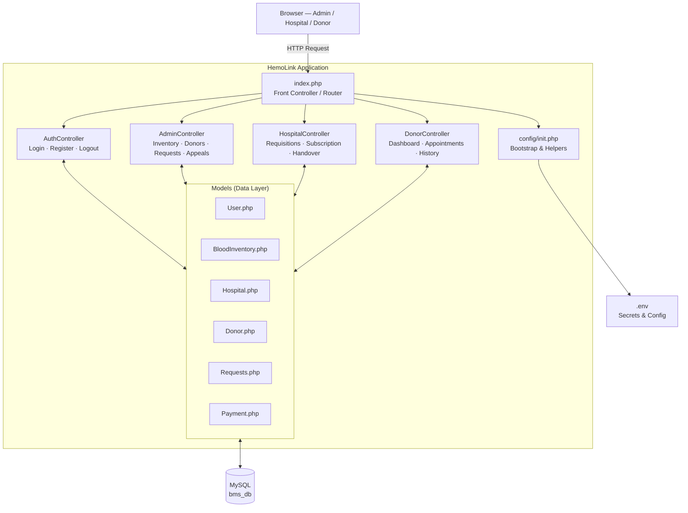
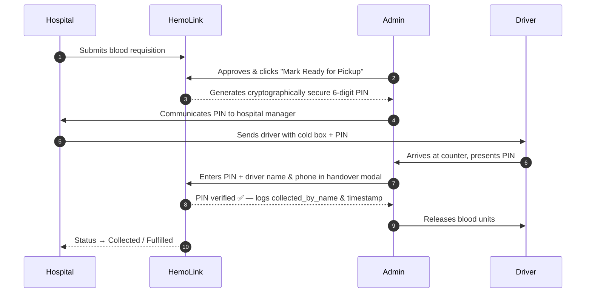
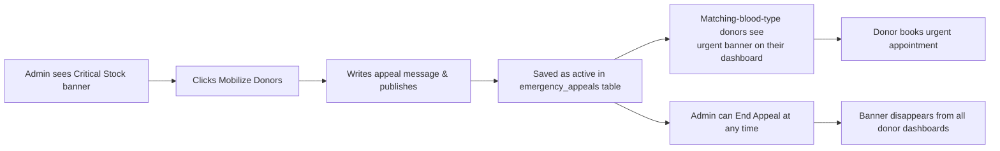

# 🩸 HemoLink — Blood Bank Management System

[](https://www.php.net/)
[](https://www.mysql.com/)
[](https://tailwindcss.com/)
[](https://fontawesome.com/)
[](#-system-architecture)
[](#-license)

> **HemoLink** is a modern, multi-role **Blood Bank Management Platform** built with PHP (MVC), MySQL, and Tailwind CSS. It connects voluntary blood donors, partner hospitals, and the central blood bank — managing everything from real-time inventory and emergency donor appeals to hospital subscriptions and secure blood handover via a **Digital Release PIN** system.

---

## 📑 Table of Contents

1. [System Architecture](#-system-architecture)
2. [Key Features](#-key-features)
   - [Admin Portal](#1-️-central-admin-portal)
   - [Hospital Portal](#2--hospital-portal)
   - [Donor Portal](#3--donor-portal)
   - [Click & Collect PIN Protocol](#4--click--collect-with-digital-release-pin)
   - [Emergency Donor Appeals](#5--emergency-donor-appeal-system)
   - [SaaS Subscriptions](#6--saas-subscription-model)
3. [Tech Stack](#-tech-stack)
4. [Project Structure](#-project-structure)
5. [Database Overview](#-database-overview)
6. [Installation & Setup](#-installation--setup)
7. [Demo Seed Accounts](#-demo-seed-accounts)
8. [Security Highlights](#-security-highlights)
9. [Documentation](#-documentation)

---

## 🏛 System Architecture

HemoLink follows a clean **Model-View-Controller (MVC)** pattern with a single-entry Front Controller:



---

## ✨ Key Features

### 1. 🛡️ Central Admin Portal

- **Live Dashboard** — KPI cards showing total active donors, partner hospitals, blood units in stock, and pending requisitions at a glance.
- **Blood Inventory Management** — Unit-level tracking across all 8 blood types with real-time status tags (`Optimal`, `Low`, `Empty`) and configurable safety thresholds.
- **Critical Stock Alerts** — When any blood type falls below its minimum threshold, a banner appears on the dashboard with an immediate mobilization shortcut.
- **Configurable Thresholds** — Admins can update the minimum safe stock level per blood type directly from the dashboard.
- **Requisition Triage** — Review, approve, partially fulfil, dispatch, or reject hospital blood requests with a step-by-step modal.
- **Click & Collect PIN Verification** — Secure 6-digit handover verification at the counter before releasing any blood units.
- **Donor Management** — Full CRUD for donor records, eligibility status management (`Eligible`, `Deferred`, `Permanently Deferred`), and health history viewing.
- **Hospital Management** — View all partner hospitals, their subscription tiers, request history, and distribution records in a single profile page.
- **User Administration** — Enable or suspend any user account system-wide.
- **Emergency Donor Appeals** — Publish an in-app emergency broadcast visible to all eligible donors with the matching blood type.

### 2. 🏥 Hospital Portal

- **Dashboard Overview** — Summary of pending requests, requests ready for pickup, and subscription status.
- **Digital Requisitions** — Submit blood requests with urgency levels (`Normal`, `Urgent`, `Emergency`), notes, and unit quantities.
- **Live Order Tracking** — Full request lifecycle from `Pending` → `Processing` → `Ready for Pickup` → `Collected` → `Fulfilled`.
- **Release PIN Collection** — Hospitals receive a 6-digit PIN from the admin; their driver presents it at the blood bank counter for secure handover.
- **Receipt Confirmation** — Hospital manager confirms blood received after courier delivery, closing the request loop.
- **SaaS Subscription** — Compare plans and upgrade online via Paystack (card / mobile money).

### 3. 🩸 Donor Portal

- **Personalised Dashboard** — Welcome card, next appointment, total donations to date, and eligibility status.
- **Emergency Appeal Banner** — If an active emergency appeal matches the donor's blood type, a prominent banner appears with a direct "Book Urgent Donation" button.
- **Appointment Booking** — Schedule, reschedule, or cancel donation appointments.
- **Donation History** — Full log of every past donation with date, volume, location, and status.
- **Donation Certificate** — Download or print an official certificate for any completed donation.
- **Profile Management** — Update contact details, address, and personal information.

### 4. 🔐 Click & Collect with Digital Release PIN

To eliminate refrigerated transport liability and ensure biological chain-of-custody, HemoLink uses a PIN-gated handover protocol:



### 5. 🚨 Emergency Donor Appeal System

When stock for a blood type falls critically low, the admin can broadcast an in-app appeal:



### 6. 💳 SaaS Subscription Model

Hospital access is gated by a subscription tier, processed via **Paystack**:

| Plan | Monthly Price | Requisition Limit | Emergency Priority |
|---|---|---|---|
| **Starter** *(Clinic)* | KES 6,000 | 15 / month | ❌ |
| **Professional** *(Hospital)* | KES 18,000 | Unlimited | ✅ |
| **Enterprise** *(Network)* | KES 45,000 | Unlimited | ✅ |

Annual billing saves **15%** on all plans.

---

## 🛠 Tech Stack

| Layer | Technology | Notes |
|---|---|---|
| **Backend** | PHP 8.1+ | Custom lightweight MVC, OOP, strict types |
| **Database** | MySQL 8.0+ | 14-table relational schema via PDO prepared statements |
| **Styling** | Tailwind CSS (CDN) | Custom HemoLink palette (`hemo-red`, `hemo-navy`, `hemo-charcoal`) |
| **Icons** | Font Awesome 6.x | Clinical and UI iconography |
| **Typography** | Google Fonts | `Inter` (UI) + `Playfair Display` (brand headings) |
| **Client JS** | Vanilla ES6+ | Dynamic modals, PIN forms, search filters, Paystack inline popup |
| **Payments** | Paystack API v2 | Subscription billing with KES support |
| **Web Server** | Apache (LAMPP) | URL routing via `.htaccess` + `mod_rewrite` |

---

## 📁 Project Structure

```
Blood-Bank-Management-System/
│
├── index.php                     ← Front Controller — all requests go here
├── .env                          ← Secrets: DB credentials, Paystack keys (not in git)
├── .htaccess                     ← Apache URL rewrite rules
├── BMS SCHEMA.sql                ← Full database schema (14 tables)
├── seed.sql                      ← Sample data for all tables
│
├── config/
│   ├── app.php                   ← App constants, roles, blood types, SaaS plan pricing
│   ├── database.php              ← Singleton PDO database connection
│   └── init.php                  ← Bootstrap: loads all files, starts session, auth helpers
│
├── controllers/
│   ├── AuthController.php        ← Login, logout, donor & hospital registration
│   ├── AdminController.php       ← Inventory, donors, hospitals, requests, appeals
│   ├── HospitalController.php    ← Requisitions, handover, subscription
│   └── DonorController.php       ← Dashboard, appointments, history, certificate
│
├── models/
│   ├── User.php                  ← Auth, registration, account status
│   ├── BloodInventory.php        ← Stock levels, units, thresholds, emergency appeals
│   ├── Hospital.php              ← Hospital records, requests, distributions, PIN
│   ├── Donor.php                 ← Donor profiles, donations, appointments, health
│   ├── Requests.php              ← Requisition CRUD helpers
│   └── Payment.php               ← Paystack payment recording & verification
│
├── views/
│   ├── landing.php               ← Public homepage
│   ├── auth/                     ← login.php, register_donor.php, register_hospital.php
│   ├── admin/                    ← dashboard, donors, hospitals, hospital_profile, requests, users
│   ├── hospital/                 ← dashboard, blood_requests, subscription
│   ├── donor/                    ← dashboard, appointments, donation_history, certificate, profile
│   └── layouts/                  ← Shared sidebars, headers, footers, nav
│
└── Docs/                         ← 📖 Full developer documentation
    ├── README.md
    ├── 00-getting-started.md
    ├── 01-architecture.md
    ├── 02-codebase-guide.md
    ├── 03-user-journey.md
    ├── 04-security.md
    └── 05-database.md
```

---

## 🗄 Database Overview

The `bms_db` database has **14 tables**. The `users` table is the central entity — all three user roles (Admin, Hospital Manager, Donor) live in one table with role-specific columns.

| Table | Purpose |
|---|---|
| `users` | All accounts — admins, hospital managers, donors |
| `hospitals` | Partner hospital records + subscription details |
| `stock_thresholds` | Configurable minimum safety stock per blood type |
| `emergency_appeals` | Active in-app donor mobilization broadcasts |
| `donations` | Individual donation events |
| `blood_units` | Physical inventory (one row = one blood bag) |
| `requests` | Hospital blood requisitions with full lifecycle tracking |
| `request_items` | Line items for multi-component requests |
| `distributions` | Dispatch & delivery logistics records |
| `payments` | Paystack subscription transaction ledger |
| `appointments` | Donor appointment scheduling |
| `blood_tests` | Lab screening results (HIV, Hepatitis, etc.) |
| `donor_health_history` | Vital signs and deferral records |
| `audit_logs` | System-wide change trail (who changed what & when) |

---

## 🚀 Installation & Setup

### Prerequisites

- **XAMPP / LAMPP** with Apache + MySQL running
- **PHP 8.1+** with `pdo_mysql`, `curl`, `mbstring` extensions
- **Git**

### 1 — Clone the repo

```bash
# Linux (LAMPP)
cd /opt/lampp/htdocs
git clone <repo-url> Blood-Bank-Management-System

# Windows (XAMPP)
cd C:\xampp\htdocs
git clone <repo-url> Blood-Bank-Management-System
```

### 2 — Create the `.env` file

Create a `.env` file in the project root:

```ini
DB_HOST=localhost
DB_NAME=bms_db
DB_USER=root
DB_PASS=

PAYSTACK_PUBLIC_KEY=pk_test_xxxxxxxx
PAYSTACK_SECRET_KEY=sk_test_xxxxxxxx
PAYSTACK_CURRENCY=KES

PLAN_STARTER_MONTHLY=6000
PLAN_PRO_MONTHLY=18000
PLAN_ENTERPRISE_MONTHLY=45000
```

### 3 — Set up the database

```bash
# Linux
/opt/lampp/bin/mysql -u root -e "CREATE DATABASE IF NOT EXISTS bms_db;"
/opt/lampp/bin/mysql -u root bms_db < "BMS SCHEMA.sql"
/opt/lampp/bin/mysql -u root bms_db < seed.sql
```

Or use **phpMyAdmin** at `http://localhost/phpmyadmin` to create `bms_db` and import both SQL files.

### 4 — Open in browser

```
http://localhost/Blood-Bank-Management-System/index.php
```

---

## 🔑 Demo Seed Accounts

After running `seed.sql`, these accounts are ready to use:

| Role | Email | Password | Notes |
|---|---|---|---|
| 🛡️ **System Admin** | `admin@hemolink.com` | `admin123` | Full system control |
| 🏥 **Hospital Manager** | `manager@knh.go.ke` | `hospital123` | Kenyatta National Hospital (Enterprise plan) |
| 🏥 **Hospital Manager** | `manager@agakhan.org` | `hospital123` | Aga Khan Hospital (Professional plan) |
| 🏥 **Hospital Manager** | `manager@mpshahospital.com` | `hospital123` | M.P. Shah Hospital (Starter plan) |
| 🩸 **Donor** | `brian.otieno@gmail.com` | `donor123` | Blood group `O+` — Eligible |
| 🩸 **Donor** | `david.odhiambo@gmail.com` | `donor123` | Blood group `O-` — Eligible (universal donor) |
| 🩸 **Donor** | `grace.wanjiku@gmail.com` | `donor123` | Blood group `A+` — Eligible |
| 🩸 **Donor** | `alice.njeri@gmail.com` | `donor123` | Blood group `AB+` — **Deferred** |

---

## 🔒 Security Highlights

| Threat | Protection |
|---|---|
| Stolen passwords | `password_hash()` with `PASSWORD_BCRYPT` — never stored in plain text |
| SQL Injection | PDO prepared statements on every single database query |
| XSS attacks | `htmlspecialchars(trim($input), ENT_QUOTES, 'UTF-8')` on all output |
| Unauthorized page access | `requireAuth()` and `requireRole()` guards on every route |
| Exposed API keys | `.env` file excluded from git — never hardcoded |
| Wrong person collecting blood | Cryptographically secure 6-digit release PIN (`random_int()`) |
| Suspended users logging in | `is_active = 1` filter on every login query |
| Session hijacking | `cookie_httponly` and `use_strict_mode` session settings |

See the full breakdown in [`Docs/04-security.md`](Docs/04-security.md).

---

## 📖 Documentation

Full developer documentation is in the [`Docs/`](Docs/) folder:

| Doc | Contents |
|---|---|
| [Getting Started](Docs/00-getting-started.md) | Install, configure, and run locally |
| [Architecture](Docs/01-architecture.md) | MVC overview, request lifecycle, design decisions |
| [Codebase Guide](Docs/02-codebase-guide.md) | Every file, class, and method explained |
| [User Journey](Docs/03-user-journey.md) | Step-by-step flows for all three user roles |
| [Security Guide](Docs/04-security.md) | Auth, RBAC, SQL injection, XSS, PIN system |
| [Database Guide](Docs/05-database.md) | All 14 tables, ERD, blood type compatibility |

---

## 📄 License

This project is open-source and available under the **MIT License**.
