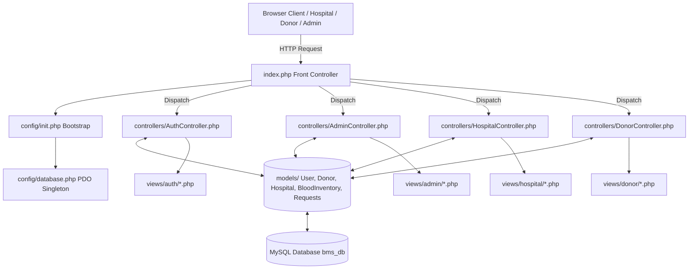
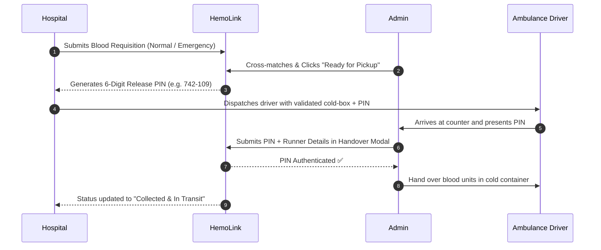

# 🩸 HemoLink - Blood Bank Management System (BMS)

[](https://www.php.net/)
[](https://www.mysql.com/)
[](https://tailwindcss.com/)
[](https://fontawesome.com/)
[](#-architecture--design)

> **HemoLink** is a modern, high-performance, and secure **Blood Bank Management Platform** built with pure PHP (MVC Architecture), MySQL, and Tailwind CSS. It connects voluntary blood donors, regional hospitals, and central blood banks with real-time inventory visibility, emergency triage queues, and a secure **"Click & Collect with Digital Release PIN"** biological chain-of-custody handover protocol.

---

## 📑 Table of Contents
1. [System Architecture](#-system-architecture)
2. [Key Features](#-key-features)
   - [Admin Portal](#1-central-admin-portal)
   - [Hospital Portal](#2-hospital-portal)
   - [Donor Portal](#3-donor-portal)
   - [Click & Collect Protocol](#4-click--collect-with-digital-release-pin)
3. [Tech Stack](#-tech-stack)
4. [Project Directory Structure](#-project-directory-structure)
5. [Installation & Setup Guide](#-installation--setup-guide)
6. [Demo Seed Accounts](#-demo-seed-accounts)
7. [Commercial & SaaS Model](#-commercial--saas-model)
8. [Security Highlights](#-security-highlights)

---

## 🏛 System Architecture

HemoLink follows a clean **Model-View-Controller (MVC)** design pattern with a single entry Front Controller routing system:



---

## ✨ Key Features

### 1. 🛡️ Central Admin Portal
* **Live Operational Dashboard:** Real-time KPI summary (total active donors, registered hospitals, available units, and critical stock threshold alerts).
* **Inventory Management:** Component-level stock tracking across all 8 blood types (`A+`, `A-`, `B+`, `B-`, `AB+`, `AB-`, `O+`, `O-`) and blood components (PRBC, Platelets, Plasma, Cryoprecipitate).
* **Requisition Triage & Dispatch:** Review, allocate, and dispatch blood units for hospital requisitions.
* **Click & Collect Verification:** Counter verification modal to validate hospital runner release PINs before biological release.
* **Hospital & Donor CRUD:** Full lifecycle management, verification status toggles, and donor eligibility management (`Eligible`, `Deferred`, `Permanently Deferred`).

### 2. 🏥 Hospital Portal
* **Live Blood Stock Cloud:** Real-time visibility into central blood bank reserves, eliminating hours of manual phone calls.
* **Digital Requisitions:** Structured requisition form supporting `Normal` vs `Emergency` priority triage with case notes.
* **Order Tracking Lifecycle:** Live tracking from `Pending` ➔ `Processing` ➔ `Ready for Pickup` ➔ `Fulfilled`.
* **Dynamic Digital Release PIN:** Automatic generation of a 6-digit cryptographic release PIN for the hospital's ambulance driver/courier.
* **Facility Management:** Hospital licensing data, contact points, and blood donation appointment coordination.

### 3. 🩸 Donor Portal
* **Donor Dashboard:** View donation history, total units donated, and current eligibility countdown.
* **Appointment Scheduling:** Book blood donation appointments at affiliated regional hospital facilities.
* **Profile & Medical Data:** Manage personal details, address, emergency contact, and view blood grouping.

### 4. 🔐 Click & Collect with Digital Release PIN
To eliminate the extreme legal liability, CapEx, and biological spoiling risks of operating an in-house refrigerated transport fleet, HemoLink utilizes a secure **Click & Collect** protocol:



---

## 🛠 Tech Stack

| Layer | Technology | Description |
| :--- | :--- | :--- |
| **Backend** | **PHP 7.4+ / 8.x** | Custom lightweight MVC architecture, OOP structure |
| **Database** | **MySQL / MariaDB** | Relational schema (`bms_db`) using PDO with prepared statements |
| **Styling** | **Tailwind CSS (CDN)** | Custom HemoLink healthcare palette (`hemo-red`, `hemo-navy`, `hemo-gold`) |
| **Icons** | **Font Awesome 6.4.0** | Comprehensive clinical and UI iconography |
| **Typography** | **Google Fonts** | `Inter` (UI & tables) + `Playfair Display` (Brand headings) |
| **Client Scripting** | **Vanilla JS (ES6+)** | Dynamic modals, Paystack inline popups, toast notifications, search filters |
| **Web Server** | **Apache (XAMPP/LAMP)** | Clean URL routing with `mod_rewrite` via `.htaccess` |

---

## 📁 Project Directory Structure

```
Blood-Bank-Management-System/
├── config/
│   ├── app.php                # Global constants, roles, and SaaS plan pricing
│   ├── database.php           # PDO Singleton database connection wrapper
│   └── init.php               # Application bootstrap, session init, auth helpers
├── controllers/
│   ├── AdminController.php    # Admin dashboard, inventory dispatch, PIN verification
│   ├── AuthController.php     # User registration, login, session termination
│   ├── DonorController.php    # Donor dashboard, appointments, profile
│   └── HospitalController.php # Requisitions, order history, SaaS subscriptions
├── models/
│   ├── BloodInventory.php     # Blood units, stock summaries, critical alerts
│   ├── Donor.php              # Donor-specific data layer & statistics
│   ├── Hospital.php           # Hospital data layer, requests, and facilities
│   ├── Payment.php            # Paystack API verification & subscription ledger
│   ├── Requests.php           # Requisition lifecycle and query filters
│   └── User.php               # User authentication, RBAC, and account status
├── views/
│   ├── admin/                 # Admin dashboards, donors, hospitals, requests
│   ├── auth/                  # Login, Donor registration, Hospital registration
│   ├── donor/                 # Donor portal, appointment booking, history
│   ├── hospital/              # Requisitions, dashboard, subscription plans
│   └── layouts/               # Header, sidebar, footer, toasts, mobile navbar
├── .env                       # Environment variables (DB credentials, Paystack keys)
├── .htaccess                  # Apache URL rewrite rules
├── index.php                  # Front Controller / Application Router
├── seed.sql                   # Database initialization & demo seed dataset
├── migration.sql              # Database schema migrations
├── why we are charging.md     # Commercial justification & SaaS architecture
└── Paystack implementation.md # Paystack integration step-by-step guide
```

---

## 🚀 Installation & Setup Guide

### 1. Prerequisites
* **XAMPP / LAMP / WampServer** installed with:
  * **PHP:** >= 7.4 or 8.x (with `pdo_mysql`, `curl`, and `mbstring` extensions enabled)
  * **MySQL / MariaDB:** >= 5.7 or 8.0
  * **Apache:** with `mod_rewrite` enabled

### 2. Clone / Copy Repository
Place the repository in your web server's root directory:
```bash
# On Linux (XAMPP / LAMPP):
cd /opt/lampp/htdocs/
git clone https://github.com/your-username/Blood-Bank-Management-System.git BMS

# On Windows (XAMPP):
# Clone into C:\xampp\htdocs\BMS
```

### 3. Database Setup
1. Start **Apache** and **MySQL** in your XAMPP Control Panel.
2. Open **phpMyAdmin** (`http://localhost/phpmyadmin`) or MySQL CLI:
   ```sql
   CREATE DATABASE `bms_db` CHARACTER SET utf8mb4 COLLATE utf8mb4_unicode_ci;
   ```
3. Import the seed dataset:
   ```bash
   mysql -u root -p bms_db < seed.sql
   ```

### 4. Environment Configuration
Create or edit the [`.env`](file:///opt/lampp/htdocs/Blood-Bank-Management-System/.env) file in the root directory:
```ini
DB_HOST=localhost
DB_USER=root
DB_PASS=
DB_NAME=bms_db

# Optional: Paystack API Credentials (for SaaS Subscriptions)
PAYSTACK_PUBLIC_KEY=pk_test_xxxxxxxxxxxxxxxxxxxxxxxxxxxxxxxxxxxxxxxx
PAYSTACK_SECRET_KEY=sk_test_xxxxxxxxxxxxxxxxxxxxxxxxxxxxxxxxxxxxxxxx
PAYSTACK_CURRENCY=KES
```

### 5. Access the Application
Open your browser and navigate to:
```
http://localhost/BMS/
# or
http://localhost/Blood-Bank-Management-System/
```

---

## 🔑 Demo Seed Accounts

The included [`seed.sql`](file:///opt/lampp/htdocs/Blood-Bank-Management-System/seed.sql) comes pre-populated with ready-to-use accounts for all roles:

| Role | Email / Username | Password | Notes |
| :--- | :--- | :--- | :--- |
| **System Admin** | `admin@hemolink.com` (`admin`) | `admin123` | Full administrative control & inventory management |
| **Hospital Manager** | `manager@knh.go.ke` (`knh.manager`) | `hospital123` | Kenyatta National Hospital Manager |
| **Hospital Manager** | `manager@agakhan.org` (`aga.manager`) | `hospital123` | Aga Khan University Hospital Manager |
| **Hospital Manager** | `manager@mpshahospital.com` (`mp.manager`) | `hospital123` | MP Shah Hospital Manager |
| **Voluntary Donor** | `brian.otieno@gmail.com` | `donor123` | Blood Group `O+` (Eligible) |
| **Voluntary Donor** | `grace.wanjiku@gmail.com` | `donor123` | Blood Group `A+` (Eligible) |
| **Voluntary Donor** | `alice.njeri@gmail.com` | `donor123` | Blood Group `AB+` (Deferred) |

---

## 💼 Commercial & SaaS Model

HemoLink operates on a **B2B SaaS Subscription Model** for healthcare facilities:

* **Starter (Clinic) - KES 6,000 / month:** Up to 15 requisitions/month, live inventory view, standard support.
* **Professional (Hospital) - KES 18,000 / month:** Unlimited requisitions, Emergency Priority Triage queue, multi-staff accounts, Click & Collect PINs.
* **Enterprise (Referral Network) - KES 45,000 / month:** Regional multi-hub stock balancing, dedicated donor mobilization drive slots, 24/7 SLA.

*For complete details, see [`why we are charging.md`](file:///opt/lampp/htdocs/Blood-Bank-Management-System/why%20we%20are%20charging.md) and [`Paystack implementation.md`](file:///opt/lampp/htdocs/Blood-Bank-Management-System/Paystack%20implementation.md).*

---

## 🔒 Security Highlights

* **Prepared Statements:** All database queries utilize PDO parameter binding, preventing SQL Injection.
* **Password Encryption:** Passwords hashed with `PASSWORD_BCRYPT` via native `password_hash()`.
* **Session Hardening:** Cookie protection with `session.cookie_httponly` and `session.use_strict_mode`.
* **XSS Sanitization:** All view outputs pass through `htmlspecialchars(trim($input), ENT_QUOTES, 'UTF-8')`.
* **Role Guards:** Route protection via `requireAuth()` and `requireRole()` middleware in [`config/init.php`](file:///opt/lampp/htdocs/Blood-Bank-Management-System/config/init.php).

---

## 📄 License
This project is open-source and available under the **MIT License**.
