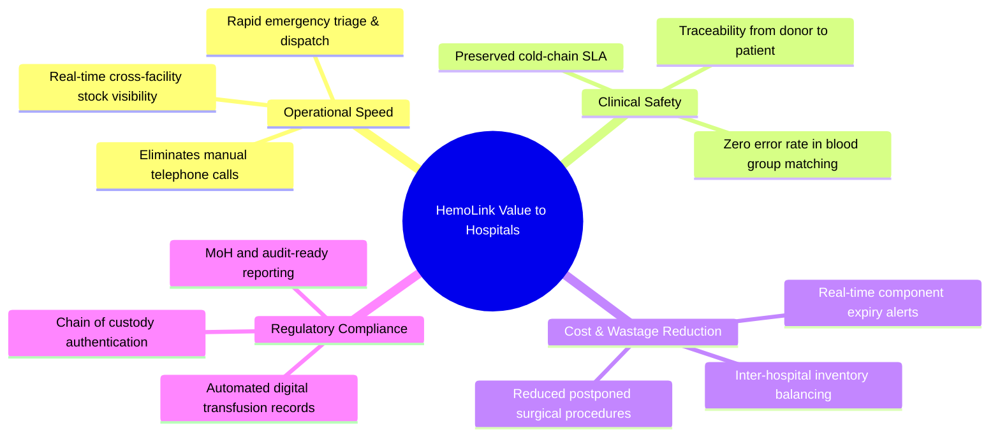
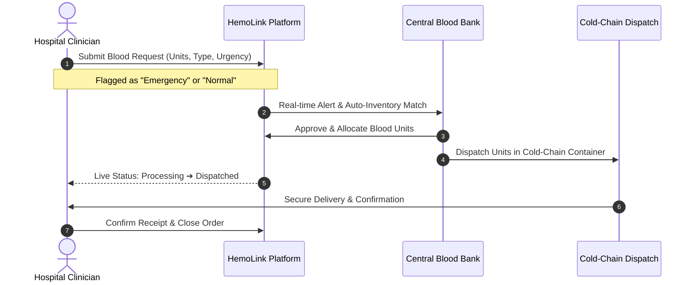
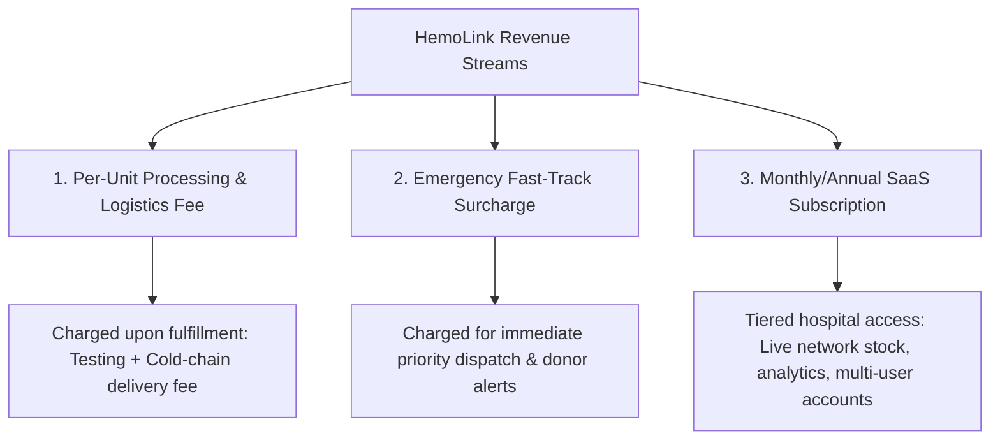

# HemoLink Blood Bank Management System
## Value Proposition & Commercial Justification Specification

---

## 1. Executive Summary & Legal Framework

### 1.1 The Legal & Ethical Foundation
In modern healthcare regulations (including WHO guidelines and National Blood Transfusion policies), **human blood is a voluntary biological gift and cannot be sold for commercial profit**. 

However, healthcare systems, blood banks, and hospital networks globally and regionally operate on a **cost-recovery and service-fee model**. What hospitals are billed for is **not the blood itself**, but the critical chain of operations required to make that blood clinically viable and accessible:
- **TTIs (Transfusion-Transmissible Infections) Screening & Serology:** Testing for HIV 1 & 2, Hepatitis B, Hepatitis C, and Syphilis.
- **Component Fractionation & Separation:** Centrifugation into Packed Red Blood Cells (PRBC), Fresh Frozen Plasma (FFP), and Platelets.
- **Cold-Chain Maintenance:** Continuous temperature-controlled preservation ($2^\circ\text{C}$ to $6^\circ\text{C}$ for RBCs, $-18^\circ\text{C}$ for Plasma, $20^\circ\text{C}$ to $24^\circ\text{C}$ with agitation for Platelets).
- **Digital Infrastructure & Logistics:** Real-time matching, tracking, emergency dispatch, and audit compliance.

---

## 2. Core Value Pillars: Why Hospitals Pay for HemoLink

---

## 3. Services Currently Provided by HemoLink

### 3.1 Live Central Blood Bank Inventory Visibility
* **The Problem It Solves:** Hospital lab technicians and clinical officers currently spend hours frantically calling multiple blood banks and referral facilities during emergencies to check whether specific blood types or components are available.
* **The HemoLink Solution:** A centralized, live-synced dashboard detailing inventory across all 8 blood groups (`A+`, `A-`, `B+`, `B-`, `AB+`, `AB-`, `O+`, `O-`) and separated components.
* **Economic Value to Hospital:** Eliminates manual labor, drastically shortens pre-op preparation times, and prevents unnecessary emergency transfers.

---

### 3.2 Digital Requisition & Emergency Triage Workflow
* **The Problem It Solves:** Paper-based requisitions are prone to manual transcription errors, delays in physical approval, and lack priority signaling.
* **The HemoLink Solution:** Structured digital requisitions supporting standard and high-priority `Emergency` requests with automated notifications and clinical case referencing.
* **Economic Value to Hospital:** Direct access to emergency priority queues, ensuring critical trauma and surgical units receive blood within guaranteed SLA windows.

---

### 3.3 End-to-End Fulfillment Lifecycle & Traceability
* **The Problem It Solves:** Blood units are strictly regulated biological products. If an adverse transfusion event occurs, paper trails are slow and incomplete.
* **The HemoLink Solution:** Complete order lifecycle logging (`Pending` ➔ `Processing` ➔ `Fulfilled` / `Partially Fulfilled` ➔ `Dispatched` ➔ `Received`), logging exact batch timestamps, fulfilled quantities, and user identifiers.
* **Economic Value to Hospital:** Guaranteed compliance with hospital accreditation bodies, medical boards, and Ministry of Health inspection requirements.

---

### 3.4 Donor Pipeline & Hospital Appointment Channeling
* **The Problem It Solves:** Individual hospitals struggle with donor acquisition and retaining recurring voluntary donors for their on-site donation suites.
* **The HemoLink Solution:** The platform connects pre-screened, eligible voluntary donors directly to affiliated hospital facilities for scheduled blood donation appointments.
* **Economic Value to Hospital:** Continuous replenishment of the hospital's internal blood reserve without incurring dedicated marketing and donor recruitment costs.

---

## 4. Traditional vs. HemoLink Workflow Comparison

```mermaid
flowchart TD
    subgraph Traditional [Traditional Manual Workflow - High Delay & Risk]
        T1[Emergency Patient Needs Blood] --> T2[Staff Calls Multiple Blood Banks]
        T2 --> T3[Manual Paper Form Written]
        T3 --> T4[Driver Dispatched Blindly]
        T4 --> T5[Stock Found or Rejected]
        T5 --> T6[Long Delays & High Risk of Surgical Postponement]
    end

    subgraph Modern [HemoLink Automated Workflow - Fast & Predictable]
        M1[Emergency Patient Needs Blood] --> M2[Check Live HemoLink Dashboard]
        M2 --> M3[Submit Digital Request in 30 Seconds]
        M3 --> M4[Instant Admin Matching & Allocation]
        M4 --> M5[Real-Time Tracking to Hospital Doorstep]
        M5 --> M6[Predictable Timelines & Improved Patient Outcomes]
    end
```

---

## 5. Monetization Models & Commercial Architecture

HemoLink can package its value into three flexible, commercially viable revenue models:

### 5.1 Model Breakdown

| Monetization Model | Description | Hospital Billing Justification |
| :--- | :--- | :--- |
| **1. Per-Unit Fulfillment Fee** | Fixed fee per approved and delivered unit of blood (e.g. KES 1,500 – 3,000 / unit). | Standard screening, serology testing, component separation, and refrigerated handling costs. Passed through to patient care / medical insurance. |
| **2. Emergency Fast-Track Surcharge** | Premium fee applied when hospital flags order as `Emergency`. | Guaranteed SLA response time, immediate reserve unit hold, and emergency logistics dispatch. |
| **3. Facility SaaS Subscription** | Tiered monthly or annual subscription for hospital account access. | Software licensing, continuous uptime, real-time inventory visibility across regional hubs, and compliance data storage. |

---

## 6. Hospital ROI (Return on Investment) Matrix

| Cost Driver Without HemoLink | Impact With HemoLink | Net Benefit to Hospital |
| :--- | :--- | :--- |
| **Canceled Surgeries ($$$):** Operating rooms sitting idle due to missing blood units. | **Guaranteed Supply Visibility:** Real-time confirmation prior to surgery scheduling. | Maximized OR utilization and retained surgical revenue. |
| **Administrative Overhead:** 2–4 hours spent per shift calling around for units. | **30-Second Requisition:** Instant digital ordering and live status notifications. | Reduced labor expenditure and nursing fatigue. |
| **Component Expiry & Wastage:** Units expiring on hospital shelves. | **Network Balancing:** Dynamic matching and automated component reallocation. | Near-zero inventory wastage costs. |
| **Medico-Legal Liability:** Incomplete donor/unit paper records during audits. | **Immutable Digital Audit Trail:** Timestamped records from donor intake to delivery. | Protection against legal liability and regulatory fines. |
