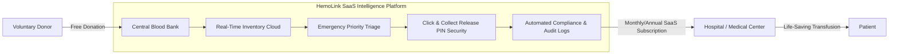
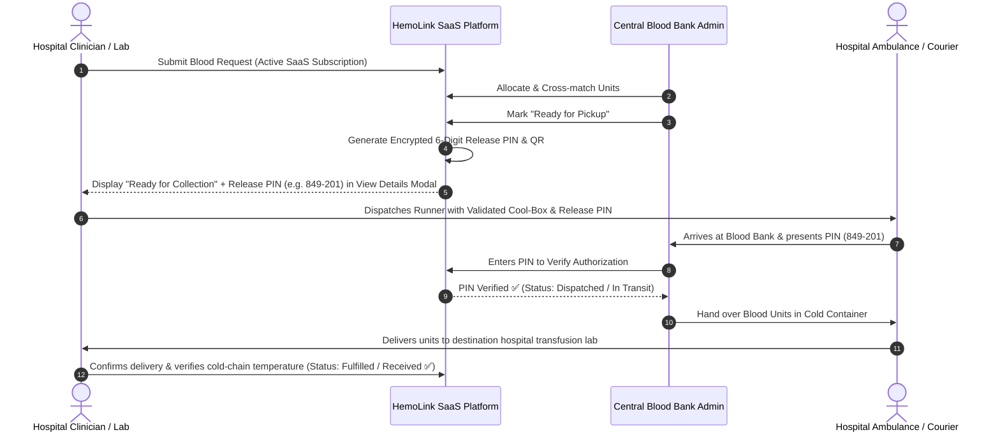
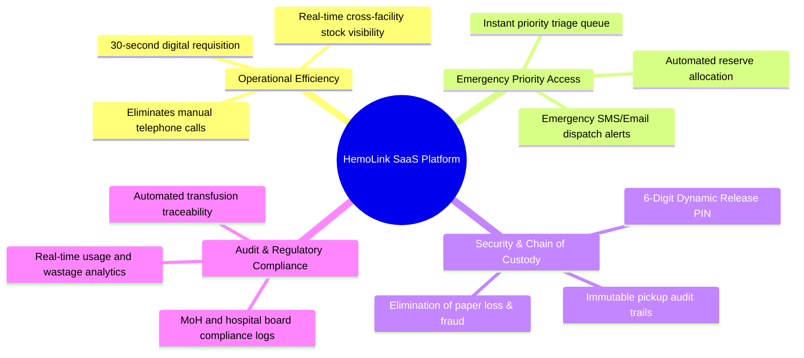
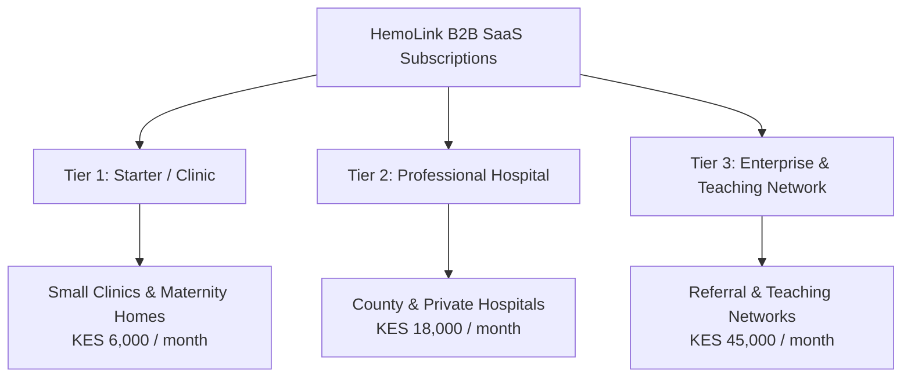

# HemoLink Blood Bank Management System
## Value Proposition, SaaS Subscription Model & "Click & Collect" Architecture

---

## 1. Executive Summary & Legal Framework

### 1.1 The Legal & Ethical Foundation
In modern healthcare regulations (including WHO guidelines and National Blood Transfusion policies), **human blood is a voluntary biological gift and cannot be sold for commercial profit**. 

HemoLink operates as a **Pure B2B SaaS (Software-as-a-Service) Healthcare Platform**. What hospitals pay for is **not blood**, but the software intelligence layer that streamlines blood banking, emergency matching, compliance tracking, and automated chain of custody.

---

## 2. Delivery & Logistics: The "Click & Collect with Digital Release PIN" Model

### 2.1 Why Not Run an In-House Delivery Fleet?
Blood components require rigorous cold-chain integrity ($2^\circ\text{C}$ to $6^\circ\text{C}$ for Red Cells, $-18^\circ\text{C}$ for Plasma, continuous agitation for Platelets). Operating an in-house fleet creates:
- High vehicle CapEx and maintenance overhead.
- Extreme legal liability if traffic delays breach cold-chain temperature limits and cause biological hemolysis.

### 2.2 The Solution: Click & Collect with Secure Digital Release PIN
HemoLink leverages existing hospital logistics (ambulances, lab dispatch couriers, and validated transport cool-boxes) combined with an encrypted **6-Digit Digital Release PIN** workflow.

### 2.3 Key Benefits of the Click & Collect Model
1. **Two-Way Cold-Chain Integrity:** Tracks both counter dispatch from the central bank and package receipt verification at the destination hospital.
2. **Elimination of Transfusion Fraud:** Biological units cannot be released to unauthorized couriers without the authenticated 6-digit dynamic token.
3. **Instant Operational Readiness:** Hospitals utilize their existing on-call ambulances and clinical drivers.

---

## 3. Core Value Pillars: Why Hospitals Subscribe to HemoLink

---

## 4. Single Monetization Strategy: SaaS Subscription Tiers

HemoLink adopts a **predictable recurring SaaS subscription model** (Monthly or Annual with a 15% annual discount) powered by Paystack recurring billing.

### 4.1 Subscription Plan Comparison

| Plan Feature | Starter (Clinic) | Professional (Hospital) | Enterprise (Network) |
| :--- | :---: | :---: | :---: |
| **Target Facility** | Clinics, Nursing Homes | Private & County Hospitals | Referral & University Hospitals |
| **Monthly Pricing** | **KES 6,000** (~$45/mo) | **KES 18,000** (~$140/mo) | **KES 45,000** (~$350/mo) |
| **Annual Billing (15% off)** | **KES 61,200 / yr** | **KES 183,600 / yr** | **KES 459,000 / yr** |
| **Live Blood Stock Visibility** | ✅ All 8 Blood Types | ✅ All 8 Blood Types + Components | ✅ Regional Multi-Hub Network |
| **Monthly Blood Requisitions** | Up to 15 requests/mo | **Unlimited Requests** | **Unlimited Requests** |
| **Click & Collect Release PIN** | ✅ Included | ✅ Included | ✅ Included + QR Scanning |
| **Emergency Priority Triage** | ❌ Standard Queue | ✅ **Fast-Track Priority Queue** | ✅ **Immediate Central Allocation** |
| **Staff User Accounts** | 2 Accounts (Lab/Doctor) | Up to 10 Accounts | **Unlimited Staff Accounts** |
| **Compliance & Audit Reports** | Basic PDF Export | Full MoH / Audit Log Export | Dedicated Data Pipeline & HIS API |
| **Support SLA** | Email (24hr response) | Phone + WhatsApp (2hr SLA) | 24/7 Dedicated Account Manager |

---

## 5. Traditional vs. HemoLink SaaS Workflow

```mermaid
flowchart TD
    subgraph Traditional [Traditional Manual Requisition - High Delay & Risk]
        T1[Emergency Patient in Need] --> T2[Staff Spends 2 Hours Calling Facilities]
        T2 --> T3[Manual Paper Form Filled & Signed]
        T3 --> T4[Ambulance Dispatched Blindly]
        T4 --> T5[Stock Out or Paper Discrepancy at Counter]
        T5 --> T6[Critical Surgical Delay or Cancellation]
    end

    subgraph Modern [HemoLink SaaS Platform - Streamlined & Secure]
        M1[Emergency Patient in Need] --> M2[Check Live Central Stock in 5 Seconds]
        M2 --> M3[Submit Digital Request with 1-Click]
        M3 --> M4[Admin Approves & Generates Digital Release PIN]
        M4 --> M5[Hospital Driver Arrives & Authenticates via PIN]
        M5 --> M6[Secure Handover in Minutes & Live Tracking]
    end
```

---

## 6. Hospital ROI (Return on Investment) Matrix

| Cost Driver Without HemoLink | Impact With HemoLink SaaS | Financial & Operational Return for Hospital |
| :--- | :--- | :--- |
| **Postponed/Canceled Surgeries** | Real-time stock visibility ensures operating rooms are never booked without confirmed blood reserves. | **Saves KES 100,000+ per canceled major surgery** in preserved theater revenue. |
| **Labor Overhead & Delays** | 30-second digital requests replace 2–3 hours of nursing and lab staff phone calls per shift. | **Reclaims 60+ clinical staff hours monthly** per department. |
| **Biological Handover Fraud & Loss** | Encrypted 6-digit dynamic PIN ensures biological units are only released to authorized hospital runners. | **100% Chain-of-Custody compliance** with zero unauthorized handovers. |
| **Accreditation & Audit Penalties** | Automated digital logging of all units received and transfused satisfies health inspector audits. | **Zero regulatory fines** and streamlined hospital license renewals. |
